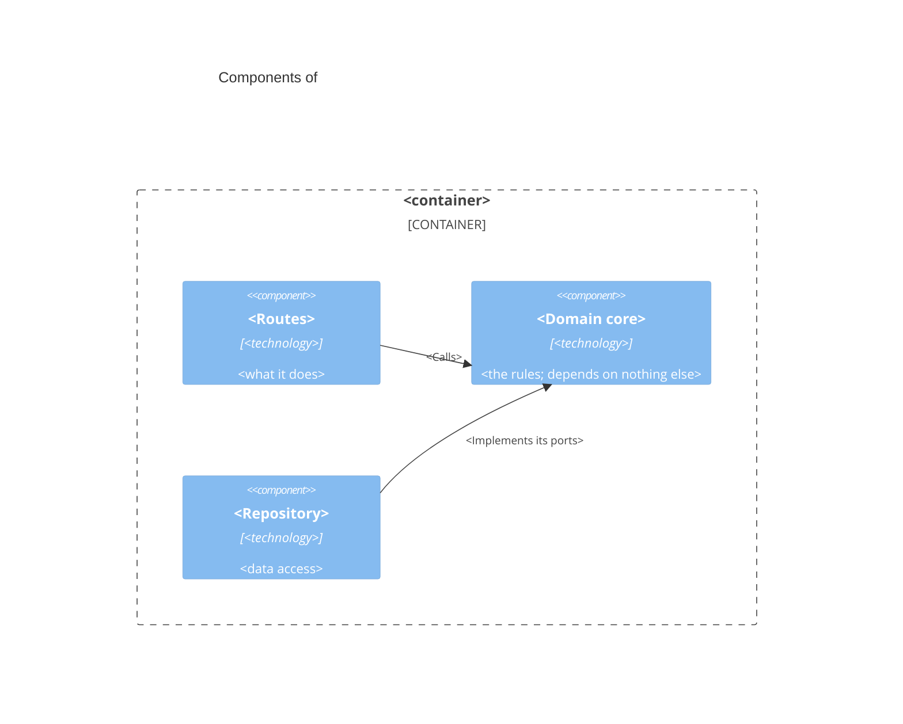

# `<PROJECT_NAME>` — Components of <container> (C4 level 3)

<!-- One per non-trivial service: the main parts inside one container and how requests move
     between them. Name the file after the container, e.g. docs/architecture/api.md. -->

