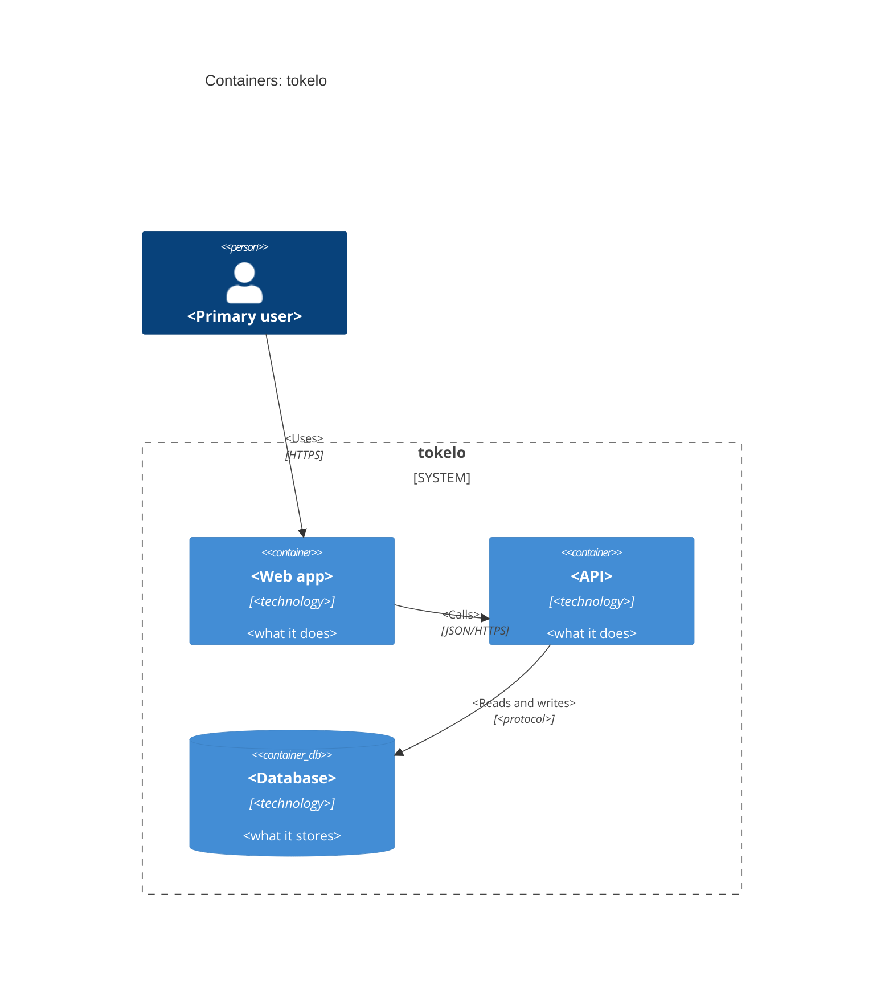

# `tokelo` — Containers (C4 level 2)

<!-- The deployable pieces inside the system box, and how they talk: each app, service and data
     store, with its technology. Required, like the context diagram. A non-trivial service also
     gets a component diagram (level 3): copy docs/architecture/component.template.md. -->

