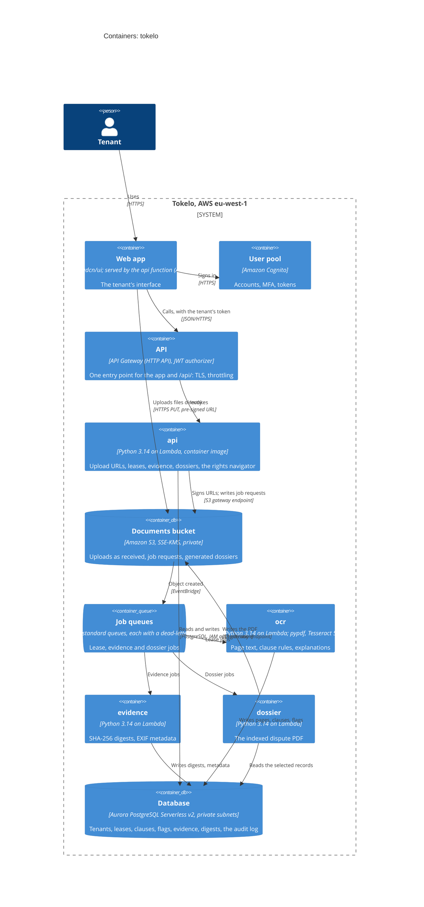

# `tokelo` — Containers (C4 level 2)

<!-- The deployable pieces inside the system box, and how they talk: each app, service and data
     store, with its technology. Required, like the context diagram. A non-trivial service also
     gets a component diagram (level 3): copy docs/architecture/component.template.md. -->

**How the pieces fit together:**

| Rule | Why | Where it's decided |
|---|---|---|
| **Every job starts as an object in S3.** An upload, or a job request the `api` writes (such as "build this dossier"), creates an object. EventBridge sends it to the job's queue | functions inside the VPC can't call SQS or EventBridge, because there's no way out of the subnets. S3 is reachable through the free gateway endpoint | ADR-0003 |
| **File bytes never pass through the API** | pre-signed URLs offload the I/O (competency 1) | REQ-002 |
| **A job that fails three times goes to its dead-letter queue** | at-least-once processing, with nothing silently lost (competency 2) | REQ-017 |
| **The functions and the database are in private subnets, with no way to or from the internet**; the database takes connections only from the functions | strict network isolation (competency 3) | ADR-0003, REQ-018 |
| **Each evidence file's SHA-256 is recorded when it's stored**, and the audit log is append-only | cryptographic integrity (competency 4) | REQ-008, REQ-011 |
| **Every service is a Lambda function from a container image,** deployed by digest by the release pipeline | $0 while idle | ADR-0002 |
| **The database pauses at 0 ACU when idle,** and connections use IAM tokens signed locally | nearly $0 while idle; no secrets endpoint needed | ADR-0004 |
