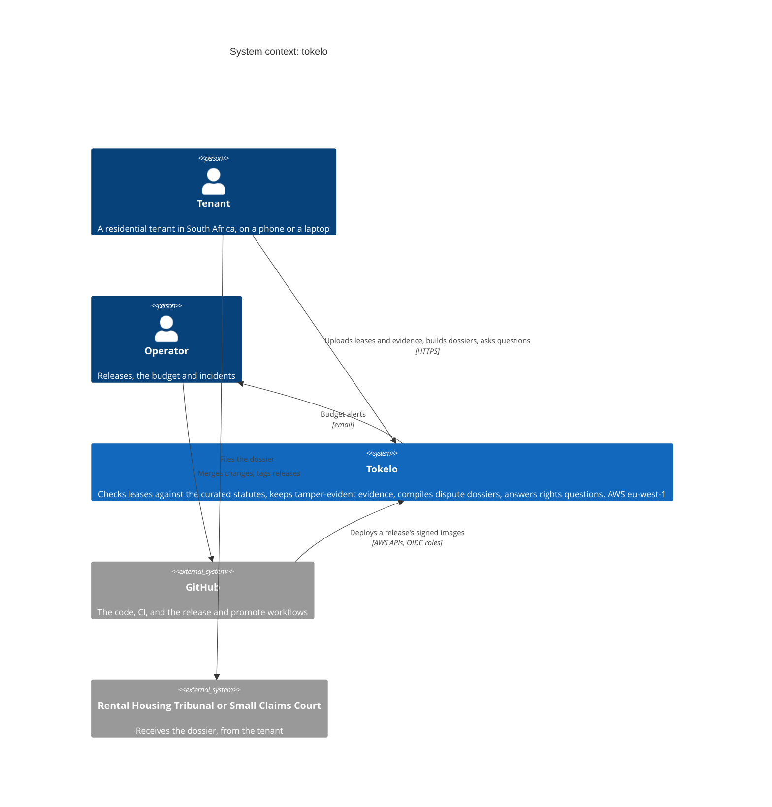

# `tokelo` — System context (C4 level 1)

<!-- The system as one box: who uses it, and which other systems it depends on. Required in every
     Secret Realm project (scripts/realm/realm design-check), and free of placeholders once any
     requirement is approved. Keep it true as the system changes: it's the first thing a new
     person, human or AI, reads. -->

- **The tenant files the dossier themselves.** Tokelo has no connection to the Tribunal or the
  courts, and it doesn't speak for the tenant.
- **Everything Tokelo runs is in one AWS account,** in `eu-west-1` (ADR-0001). The services it
  uses from AWS appear inside the box on the [containers](containers.md) diagram.
- **No language model** is called in phases 1–5 (ADR-0006), and no other outside service
  receives tenant data.
