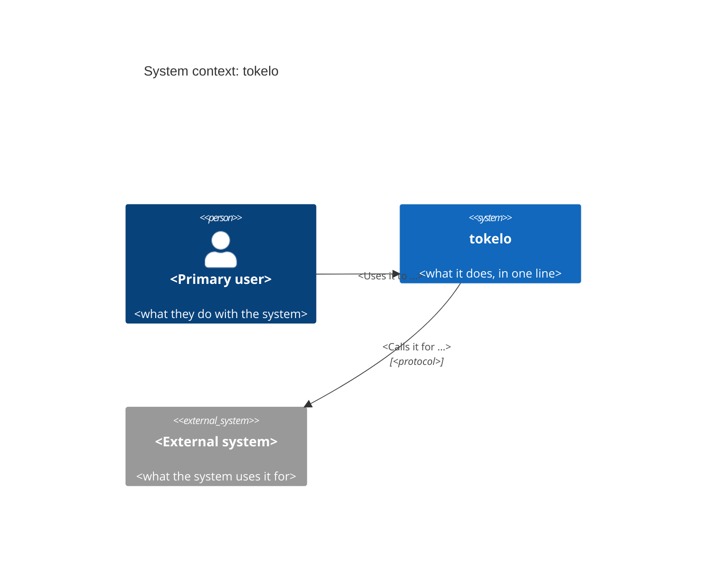

# `tokelo` — System context (C4 level 1)

<!-- The system as one box: who uses it, and which other systems it depends on. Required in every
     Secret Realm project (scripts/realm/realm design-check), and free of placeholders once any
     requirement is approved. Keep it true as the system changes: it's the first thing a new
     person, human or AI, reads. -->

