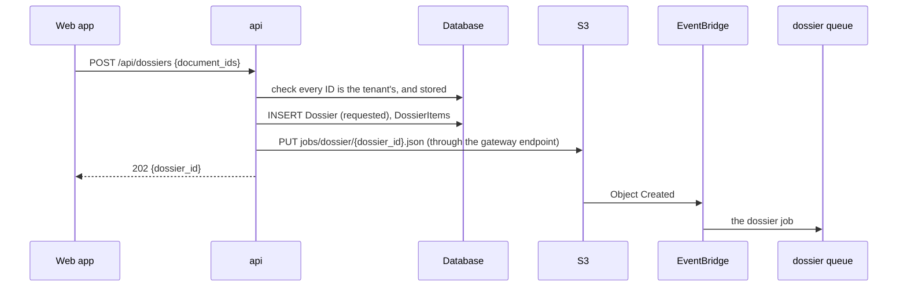

# Design — the `api` lane

**Status:** agreed · **Owner:** Katlego · **Tasks:** T002, then T011, T024, T025, T030, T034,
T039, T042, T046, T048 · **Spec:** [SPEC.md](../../SPEC.md) US1–US4

---

## 1. What this covers

The `api` Lambda function behind API Gateway's HTTP API:
- every endpoint the web app calls
- how a tenant is identified from their token
- the pre-signed uploads
- the S3 key layout
- the job requests the `api` writes for the workers
- the web app's files and `/config.json`, which it serves too (ADR-0010; [web.md](web.md))

It doesn't cover:
- the workers' own processing: [ocr.md](ocr.md), [evidence.md](evidence.md), [dossier.md](dossier.md)
- the navigator's topics and matching: [navigator.md](navigator.md)
- the resources it runs on: [infrastructure.md](infrastructure.md)
- the screens: [web.md](web.md)

## 2. Reference material

| Kind | Where |
| --- | --- |
| Requirements | REQ-001 to REQ-003, REQ-005 to REQ-007, REQ-010, REQ-013, REQ-014, REQ-016, NFR-001, NFR-002, NFR-006 |
| The tables | [domain-model.md](domain-model.md) |
| Decisions | ADR-0002 (Lambda), ADR-0003 (no way out of the VPC), ADR-0007 (standard queues), ADR-0011 (DynamoDB, superseding ADR-0004 and ADR-0008) |
| External standards | API Gateway HTTP API, payload format 2.0; its JWT authorizer, with a Cognito user pool as issuer; S3 pre-signed POST, whose policy can bound the size (`content-length-range`) |

## 3. Domain model

The `api` reads and writes the tables in [domain-model.md](domain-model.md). The shapes it
returns are §6's views, and nothing else leaves the function.

## 4. Flow

### Identity

API Gateway's JWT authorizer checks every `/api/` route. `/health`, `/config.json` and the web
app's files are open. It checks the token's issuer
(the user pool), its audience (the web app's client ID) and its expiry. A request with a bad
token never reaches the function: API Gateway answers 401 itself. The function takes the tenant
from `requestContext.authorizer.jwt.claims.sub`. On a tenant's first request, it inserts their
`Tenant` and `AuditSubject` rows.

### An upload

```mermaid
sequenceDiagram
    participant W as Web app
    participant G as API Gateway
    participant A as api
    participant D as Database
    participant S as S3
    participant E as EventBridge
    participant Q as Queue
    W->>G: POST /api/uploads {kind, content_type, size_bytes} + token
    G->>A: invoke (claims.sub = tenant)
    A->>A: check kind, type and size (REQ-003)
    A->>D: INSERT Document (requested)
    A->>A: sign a POST policy: one key, one type, 1..size bytes, 15 min
    A-->>W: 201 {document_id, url, fields, expires_at}
    W->>S: POST the file with the fields (never through the api)
    S->>E: Object Created
    E->>Q: the kind's queue (lease → lease; photo, notice, chat → evidence)
```

### A dossier request

This shows how a function inside the VPC starts a job (ADR-0003).



### Reaching the store

There is no connection to open: the function calls DynamoDB over HTTPS through the gateway
endpoint, signed with its own role (ADR-0011), and every call names the token's tenant as the
partition key. The client is built once per container and reused, with the SDK's standard retries
and a total timeout well under the function's 29 s, which is itself under the HTTP API's 30 s.

**Failure paths:**
- **DynamoDB throttles or is unreachable:** the SDK retries; if it still fails, answer
  `503 {"error": {"code": "store_unavailable", …}}` with `Retry-After: 5`. The web app shows the
  wait and retries ([web.md](web.md)).
- **A conditional write is refused** (the digest is already there, or the document exists): that
  is the job already done, not an error ([domain-model.md](domain-model.md) §3).
- **A record exists but isn't the tenant's:** answer `404`, exactly as if it didn't exist.
- **The tenant uploads nothing:** the document stays `requested` and reads `expired` after 15
  minutes ([domain-model.md](domain-model.md) §5).
- **Writing the job object fails:** the dossier is marked `failed` with the reason, and the
  request answers `503`. No dossier waits for a job that was never written.

## 5. State

The document, lease and dossier states are [domain-model.md](domain-model.md)'s §5. The `api`
only moves a document to `requested`, and a dossier to `requested`, or to `failed` when its job
can't be written.

## 6. Contracts

### Endpoints

Every `/api/` endpoint needs a valid token, and answers JSON. The web app's files and
`/config.json` are open (ADR-0010).

| Method and path | Request | Success | Errors | Requirements |
|---|---|---|---|---|
| `GET /health` | none | `200 {"ok": true}` | none | the kit's smoke check |
| `GET /config.json` | none | `200 {"region", "user_pool_id", "client_id"}`, from the function's environment | none | ADR-0010 |
| `GET /` and any other path outside `/api/` | none | the web app's files; `index.html` for an unknown path | none | ADR-0010 |
| `POST /api/uploads` | `{"kind", "content_type", "size_bytes", "filename"}` | `201 {"document_id", "url", "fields", "expires_at"}` | `422` refused, with the reason | REQ-002, REQ-003, NFR-001, NFR-006 |
| `GET /api/documents?kind=` | none | `200 {"documents": [DocumentView]}` | none | REQ-001 |
| `GET /api/documents/{id}` | none | `200 DocumentView` | `404` | REQ-001, REQ-009 |
| `GET /api/leases/{id}/flags` | none | `200 LeaseFlags` | `404`; `409` still reading | REQ-004 to REQ-007 |
| `POST /api/evidence/{id}/verify` | none | `200 Verification` | `404`; `409` not stored yet | REQ-010 |
| `GET /api/timeline` | none | `200 {"entries": [TimelineEntryView]}` | none | REQ-012 |
| `POST /api/dossiers` | `{"document_ids": [uuid]}` | `202 {"dossier_id"}` | `422` empty, more than 150 documents, or an ID not the tenant's or not stored | REQ-013 |
| `GET /api/dossiers/{id}` | none | `200 {"status", "download_url"?, "expires_at"?}` | `404` | REQ-013 |
| `POST /api/navigator` | `{"question"}` | `200 Answer` or `200 Outside` | `422` empty | REQ-014 |
| `DELETE /api/account` | none | `202` | none | REQ-016 |

`POST /api/uploads` takes a `filename` and **doesn't store it**: a file's name is the tenant's,
and often their landlord's, and nothing here needs it. The object's key is the document's ID.

### What each kind of upload accepts (REQ-003)

| `kind` | Content types | At most |
|---|---|---|
| `lease` | `application/pdf`, `image/jpeg`, `image/png` | 20 MB; 30 pages, checked by the worker |
| `photo` | `image/jpeg`, `image/png` | 20 MB |
| `notice` | `application/pdf`, `image/jpeg`, `image/png` | 20 MB |
| `chat` | `text/plain` (a WhatsApp export) | 5 MB |

### The views

```
DocumentView      = {id, kind, status, content_type, size_bytes, sha256|null, stored_at|null,
                     capture: {captured_at|"not recorded", device|"not recorded",
                               latitude|"not recorded", longitude|"not recorded"} (photos),
                     failure_reason|null}
LeaseFlags        = {status, page_count, unreadable_pages: [int], notice: NOTICE,
                     clauses: [{label, first_page, text,
                                flags: [{rule_id, explanation, sections: [SectionRef]}]
                                       or [] with finding: "no issue found by these checks"}]}
SectionRef        = {id, act, section, title}                  -- from the curated set only (REQ-006)
Verification      = {matches: bool, recorded_sha256, computed_sha256, verified_at}
TimelineEntryView = {id, occurred_at, source, summary, document_id}
Answer            = {topic, answer, sections: [SectionRef], notice: NOTICE}
Outside           = {outside: true, message, refer_to: "the Rental Housing Tribunal"}
Error             = {"error": {"code", "message"}}
NOTICE            = "This is legal information, not legal advice."
```

A clause with no flag says "no issue found by these checks", never "lawful" (REQ-007).

`page_count` is how many pages the lease has, which is what makes `unreadable_pages` mean
something: "page 3 couldn't be read" is a different thing in a 4-page lease and a 30-page one,
and the screen states both together ([web/lease.svg](web/lease.svg): "Analysed · 12 pages"). It
is the count the worker took from the file itself (REQ-003), not a count of what it managed to
read.

### The S3 key layout

| Key | Written by | What EventBridge does with it |
|---|---|---|
| `uploads/{tenant_id}/lease/{document_id}` | the tenant, through the POST | sends it to the lease queue |
| `uploads/{tenant_id}/{photo,notice,chat}/{document_id}` | the tenant, through the POST | sends it to the evidence queue |
| `jobs/page/{document_id}/{n}.json` | the `ocr` worker ([ocr.md](ocr.md)) | sends it to the page queue |
| `jobs/dossier/{dossier_id}.json` | the `api` | sends it to the dossier queue |
| `dossiers/{tenant_id}/{dossier_id}.pdf` | the `dossier` worker | nothing |

### The dossier job request

The worker checks ownership again in the tenant's partition, and never trusts the object's list alone.

```json
{"version": 1, "dossier_id": "uuid", "tenant_id": "uuid",
 "document_ids": ["uuid", "..."], "requested_at": "2026-10-01T09:00:00Z"}
```

### Download links

`GET /api/dossiers/{id}` gives a pre-signed GET that expires in 5 minutes, for the tenant's own
dossier only.

## 7. Structure

| Path | New? | Responsibility |
| --- | --- | --- |
| `src/tokelo/api/handler.py` | new | the entry point: routes on `routeKey`, maps errors to responses |
| `src/tokelo/api/auth.py` | new | the tenant from the claims, and the refusal when there isn't one (T024) |
| `src/tokelo/api/uploads.py` | new | the kinds' limits, and the POST policy (T025, T030) |
| `src/tokelo/api/documents.py`, `leases.py`, `evidence.py`, `timeline.py`, `dossiers.py`, `navigator.py`, `account.py` | new | one endpoint group each |
| `src/tokelo/api/views.py` | new | §6's views, the only shapes that leave the function |
| `src/tokelo/core/store.py` | new | the tenant-scoped calls to DynamoDB, and nothing else talks to it ([domain-model.md](domain-model.md) §7) |
| `src/tokelo/api/static.py` | new | the web app's files, their caching and security headers, `/config.json` (ADR-0010) |
| `src/tokelo/core/keys.py` | new | §6's key layout, used by the `api` and the workers alike |
| `services/api/Dockerfile` | new | Lambda's Python 3.14 base, pinned by digest |

## 8. Decisions & alternatives

| Decision | Chosen | Rejected, and why |
| --- | --- | --- |
| Pre-signed PUT or POST | **POST,** whose policy bounds the size | PUT: its signature can't bound the size, and REQ-002 needs a maximum |
| An ID that isn't the tenant's | **404** | 403: it confirms that the record exists |
| How the `api` starts a job | **an object in S3** (ADR-0003) | calling SQS or EventBridge: there's no way out of the VPC to them |
| The first request after a pause | **retry the connection for up to 20 s, then 503 with `Retry-After`** | wait longer: the HTTP API cuts the request at 30 s anyway |
| Migrations | **the RDS Data API, from the infrastructure workflow (ADR-0008)** | a handler inside the VPC, as ADR-0002 first planned: it can't reach the master secret |
| Serving the web app | **this function, from its image** (ADR-0010) | S3 and CloudFront: outside the kit's pa11y, ZAP, signing and promotion |
| Frameworks | **none:** a small router on `routeKey` | a web framework in Lambda: a bigger image and cold start, for 11 routes |

Deviations from [docs/architecture-defaults.md](../architecture-defaults.md): no web framework
and no always-on server. Both follow from ADR-0002.

## 9. How this is verified

- The unit tests, one file per endpoint group:
  - `tests/api/test_authz.py`: another tenant's record gives 404
  - `tests/api/test_presign.py`: one key, one type, the size bound, expiry within 15 minutes
  - `tests/api/test_lease_intake.py`, `test_flags.py`, `test_verify.py`,
    `test_dossier_request.py`, `test_navigator.py`, `test_delete_account.py`
- `tests/integration/test_job_spine.py` on staging: an upload reaches its queue (T026).
- `perf/upload-url.js` and `perf/first-request.js` (T049): NFR-001 and NFR-002.
- Review: each route in `handler.py` is in §6's table, and each view field is in §6.

## 10. Open questions

- [ ] **iPhone photos:** Safari usually converts HEIC to JPEG on upload, but not always. If
  tenants' photos arrive as HEIC, accepting it needs a decision (and a library) first.

## Threats (STRIDE)

| Threat | STRIDE | Where | Mitigation | Proven by |
|---|---|---|---|---|
| A forged or expired token | Spoofing | API Gateway → `api` | the JWT authorizer checks the issuer, audience and expiry before the function runs; only `/health`, `/config.json` and the web app's files are open | an unauthenticated request to each route gives 401 (T024) |
| A tenant requests another's record by ID | Information disclosure | every `{id}` route | every query filters on the token's tenant; a foreign ID gives 404 | tests/api/test_authz.py (T024) |
| An upload claims one type but carries another, or is too large | Tampering | the POST policy | the policy fixes the key, the type and the size range; the worker checks the file's actual type again | tests/api/test_presign.py, tests/api/test_lease_intake.py (T025, T030) |
| A leaked upload or download URL is reused | Information disclosure | pre-signed URLs | uploads expire in 15 minutes and fix one key; downloads expire in 5 | tests/api/test_presign.py (NFR-006) |
| A tenant denies having verified or requested something | Repudiation | verify, dossiers, account | each is an audit entry, which the application can't edit | tests/integration/test_schema.py (T023) |
| A flood of requests runs up the bill | Denial of service | API Gateway | route throttling ([infrastructure.md](infrastructure.md) §4); the budget's alerts (REQ-019) | the throttling settings in Terraform, reviewed in T020 |
| A crafted job object makes the dossier worker read another tenant's files | Elevation of privilege | `jobs/dossier/*.json` | only the `api` role can write under `jobs/`; the worker checks every ID's owner in the tenant's partition, not in the object | tests/dossier/test_pdf.py (T043) |
| A response carries a section outside the curated set | Tampering | flags, answers | views build `SectionRef`s only from the curated set, and unknown IDs are refused | tests/unit/test_rules.py, tests/unit/test_topics.py (REQ-006) |
