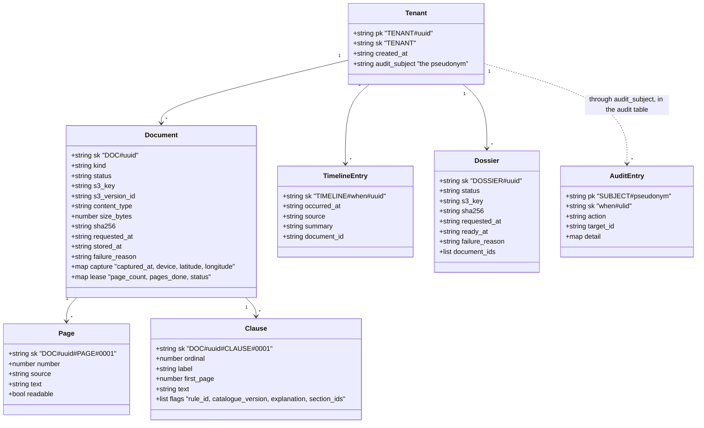
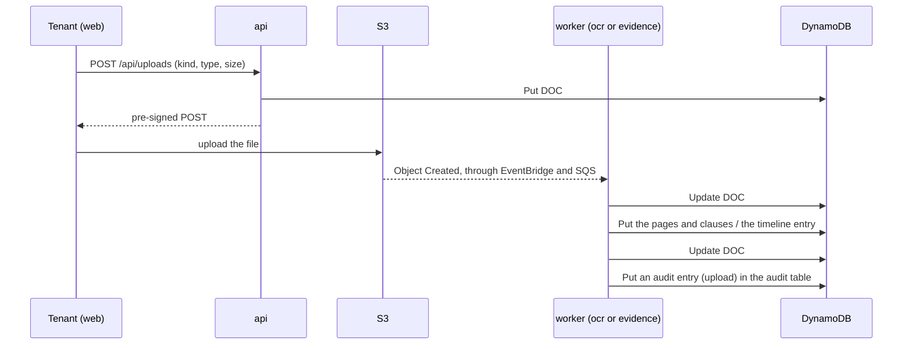
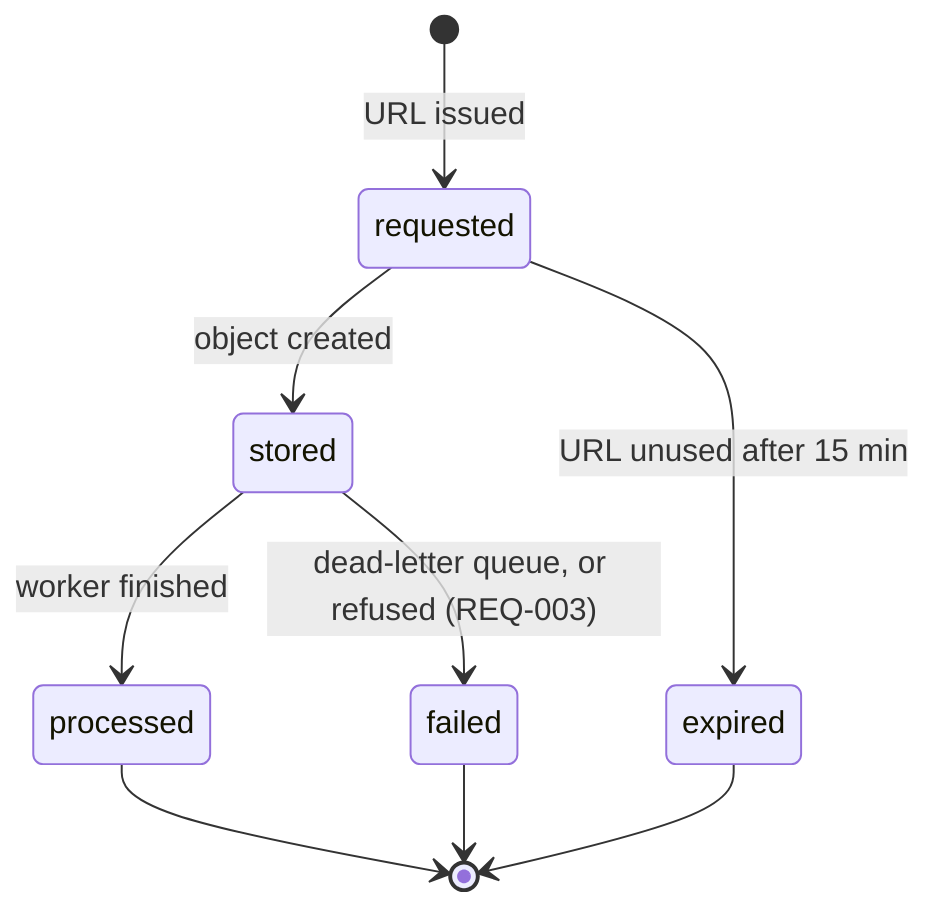

# Design — the domain model

**Status:** agreed · **Owner:** Katlego · **Tasks:** T001, then T023
and every task that reads or writes these items · **Spec:** [SPEC.md](../../SPEC.md) US1–US4

---

## 1. What this covers

The entities Tokelo stores, in DynamoDB (ADR-0011), and the rules they obey. It doesn't cover
three things that live in files, not in the store:
- the **rule catalogue** ([ocr.md](ocr.md))
- the **curated legal sections** (`docs/legal/`, T022)
- the **navigator's topics** ([navigator.md](navigator.md))

There is no schema and no migration: the tables are two Terraform resources, and the shape of an
item is the code that writes it (`src/tokelo/core/model.py`, T023). This document is what both
are checked against.

## 2. Reference material

| Kind | Where |
| --- | --- |
| Requirements | [REQUIREMENTS.md](../../REQUIREMENTS.md): REQ-001, REQ-008 to REQ-013, REQ-016 |
| Store | DynamoDB, two on-demand tables, reached through a gateway endpoint (ADR-0011) |
| Where the files are | the documents bucket's key layout, [api.md](api.md) §6 |

## 3. Domain model

Everything a tenant owns is one item in the table `tokelo-<env>`, in **one partition**:
`pk = TENANT#<tenant id>`. The sort key is the item's path under that tenant, so a query with
`begins_with` fetches exactly the aggregate that's wanted, and no query can reach another
tenant's partition (REQ-001).

**The keys, in full:**

| Item | Table | `pk` | `sk` |
|---|---|---|---|
| Tenant | `tokelo-<env>` | `TENANT#<tenant id>` | `TENANT` |
| Document (with its capture metadata and, for a lease, its reading progress) | `tokelo-<env>` | `TENANT#<tenant id>` | `DOC#<document id>` |
| Page | `tokelo-<env>` | `TENANT#<tenant id>` | `DOC#<document id>#PAGE#<number, 4 digits>` |
| Clause (with its flags) | `tokelo-<env>` | `TENANT#<tenant id>` | `DOC#<document id>#CLAUSE#<ordinal, 4 digits>` |
| Timeline entry | `tokelo-<env>` | `TENANT#<tenant id>` | `TIMELINE#<occurred_at>#<entry id>` |
| Dossier (with the documents it names) | `tokelo-<env>` | `TENANT#<tenant id>` | `DOSSIER#<dossier id>` |
| Audit entry | `tokelo-<env>-audit` | `SUBJECT#<pseudonym>` | `<at>#<ulid>` |

Every item also carries a **`type`** attribute — `tenant`, `document`, `page`, `clause`,
`timeline`, `dossier` — which is how one query's answer is sorted back into the aggregate it
belongs to, without parsing sort keys.

**The enumerations** (string attributes; the values are the code's, in `model.py`):

| Attribute | Values |
|---|---|
| `Document.kind` | `lease`, `photo`, `notice`, `chat` |
| `Document.status` | `requested`, `stored`, `processed`, `failed`, `expired` (§5) |
| `Document.lease.status` | `reading`, `analysed`, `failed` (§5) |
| `Page.source` | `text_layer`, `ocr` |
| `TimelineEntry.source` | `capture` (a photo's EXIF time), `notice`, `chat_message` |
| `Dossier.status` | `requested`, `compiling`, `ready`, `failed` (§5) |
| `AuditEntry.action` | `upload`, `verify`, `dossier`, `delete_account` |

**The rules the diagram can't show:**

| Rule | Why | Enforced by |
|---|---|---|
| **Every item of tenant data is in that tenant's partition,** and every call names `TENANT#<the token's sub>` as its partition key | a tenant sees only their own records; a query can't cross partitions | `core/store.py`, which takes the tenant as its first argument and builds every key (T023); REQ-001 |
| **`Tenant.pk` carries the Cognito user's `sub`** | no second identity to keep in step | [api.md](api.md) §4 |
| **`Document.sha256` is written once,** from the stored object, and never changes after | the digest is the evidence | the update carries `attribute_not_exists(sha256)` (T023); REQ-008 |
| **A document is created once,** with `attribute_not_exists(pk)`, and the worker's write of the digest is conditional too | a job delivered twice is a no-op (ADR-0007) | the same condition expressions |
| **`capture` is absent, not invented,** when the photo doesn't carry it; the API shows "not recorded" | never invent a capture time or place | REQ-009 |
| **A clause keeps the explanation and sections its flags were shown with,** and the catalogue version | what the tenant saw stays reproducible after the catalogue improves | [ocr.md](ocr.md) |
| **The audit log is append-only:** the functions' policies allow `PutItem` on the audit table and nothing else, and each put carries `attribute_not_exists(pk)` | an audit log that can be edited isn't one | the IAM policies ([infrastructure.md](infrastructure.md) §6); REQ-011 |
| **The audit log names a pseudonym, never the tenant** | deleting the account deletes the tenant item that holds the mapping, which leaves the entries anonymous without changing them | REQ-016 |
| **Deleting a tenant deletes their whole partition** — documents, pages, clauses, timeline, dossiers — and the tenant item with it | nothing personal is left behind | `core/store.py`'s `delete_tenant` (T048), which queries and deletes in batches; the files go with it |
| **Times are ISO-8601 in UTC, to the second** (`2026-09-20T06:20:04Z`), which sorts as text | one clock for the timeline, and a sort key that orders correctly | the API's serializers; shown in South African time (SAST, UTC+2) |
| **An item stays under 400 KB** | DynamoDB's limit | pages and clauses are their own items; file bytes are in S3 |

**What isn't stored in the tables:** the rules (code), the curated sections and the topics
(files), and file bytes (S3).

## 4. Flow

How the items come into being over a document's life:

**Failure paths:**
- **The tenant never uploads:** the document stays `requested` and becomes `expired` after the
  URL's 15 minutes, which the API reports.
- **A worker fails three times:** the job goes to the dead-letter queue, and the document becomes
  `failed` with its reason ([infrastructure.md](infrastructure.md) §4).
- **A job is delivered twice:** the conditional write fails, the worker treats that as done, and
  nothing is written twice.

## 5. State

A lease is `reading` while its pages are read, and `analysed` once the last page is done and its
clauses are flagged. It's `failed` only if no page could be read; an unreadable page alone is
recorded on its `Page` (REQ-004). A dossier goes `requested` → `compiling` → `ready`, or
`failed`. No state goes backwards: a failed document is uploaded again as a new document.

## 6. Contracts

These items are the contract between the `api` and the workers: all of them read and write the
same two tables, through `core/store.py`, and nowhere else.

**The queries, in full.** Every one of them names a partition key; there is no `Scan` in this
project.

| What is wanted | The call |
|---|---|
| A document, with its pages and clauses | `Query pk = TENANT#t and begins_with(sk, "DOC#<id>")` |
| A tenant's documents | `Query pk = TENANT#t and begins_with(sk, "DOC#")`, keeping the items of `type` `document` |
| A lease's flags | the first query above: the document, its pages (for the unreadable ones) and its clauses come back together |
| The timeline | `Query pk = TENANT#t and begins_with(sk, "TIMELINE#")`, which comes back in time order |
| One dossier | `GetItem pk = TENANT#t, sk = DOSSIER#<id>` |
| A tenant's audit entries | `Query pk = SUBJECT#<pseudonym>` on the audit table |
| Everything of a tenant's, to delete it | `Query pk = TENANT#t`, then `BatchWriteItem` deletes, page by page |

Two writes that must land together — a document and its timeline entry — are in one partition, so
`TransactWriteItems` covers them.

## 7. Structure

| Path | New? | Responsibility |
| --- | --- | --- |
| `infra/modules/tokelo-env/tables.tf` | new | the two tables, on-demand, with the keys above (T018) |
| `src/tokelo/core/store.py` | new | the only code that talks to DynamoDB: the keys, the queries above, the condition expressions, and the tenant-scoped access (T023). The one place boto3, which ships no types, meets typed code |
| `src/tokelo/core/model.py` | new | the item types and the enumerations above, and nothing else |

## 8. Decisions & alternatives

| Decision | Chosen | Rejected, and why |
| --- | --- | --- |
| How the relational schema becomes items | **one partition per tenant,** with the entity's path as the sort key | a table per entity: every read of a document would be four queries, and nothing would keep them in one partition for a transaction |
| Where a document's capture metadata and a lease's progress live | **attributes of the document item** | their own items: they are read with the document every time, and never without it |
| Where a clause's flags live | **a list on the clause item** | their own items: a clause has a handful of flags, they are always read together, and the item stays far under 400 KB |
| Where a dossier's documents live | **a list of IDs on the dossier item** | join items: the list is at most 150 IDs, and the dossier is read whole |
| Pages and clauses as their own items | **yes** | attributes of the document: 30 pages of text would push the item towards DynamoDB's 400 KB limit |
| Capacity | **on-demand** | provisioned: it must be sized, and an idle environment would still pay for it |
| Secondary indexes | **none** | every access pattern in §6 starts from the tenant; an index would cost storage to answer a question nobody asks |
| Identifiers | **UUIDv4**, and a ULID for an audit entry's sort key | serial IDs in URLs let one tenant count another's records; the audit log needs its entries to sort by time |
| The audit log's table | **its own table,** keyed by pseudonym | the tenant's partition: deleting the account would delete the audit trail, which REQ-011 forbids |

Deviations from [docs/architecture-defaults.md](../architecture-defaults.md): none that this
lane decides. The store itself is ADR-0011's, which departs from the specification's RDS.

## 9. How this is verified

- `tests/integration/test_store.py` (T023), against **DynamoDB Local** in Docker:
  - a second `sha256` for a document is refused, and the first one stays
  - creating the same document twice leaves one item, and the second call reports it
  - a query for one tenant returns nothing of another tenant's, with the same document ID
  - deleting a tenant leaves no item of theirs, and their audit entries still exist without a
    subject anyone can resolve
- `tests/api/test_authz.py` (T024): the API answers 404, not 403, for another tenant's ID.
- Review: every attribute in `model.py` is in §3, and every item in §3 is in `model.py`.
- The audit log's append-only rule is IAM's, so it is reviewed in the Terraform and checked in
  T051's inspection, not in a unit test.

## 10. Open questions

- [ ] How long a `failed` or `expired` document's item is kept. Proposed: until the tenant deletes
  it or their account; nothing is removed automatically. A DynamoDB TTL attribute is the cheap way
  to change that decision later.

## Threats (STRIDE)

| Threat | STRIDE | Where | Mitigation | Proven by |
|---|---|---|---|---|
| A tenant reads another tenant's items | Information disclosure | both tables | every call names `TENANT#<the token's sub>` as its partition key, built in one place; the API answers 404, not 403 | tests/api/test_authz.py (T024), tests/integration/test_store.py (T023) |
| The application rewrites the audit log to hide an action | Repudiation | the audit table | the functions' policies allow `PutItem` alone on it, and each put refuses an existing key | the IAM policies, reviewed in T020 and inspected in T051 |
| A digest is changed after the fact, so a changed file "verifies" | Tampering | `Document.sha256` | the write carries `attribute_not_exists(sha256)` | tests/integration/test_store.py (T023) |
| An account deletion leaves personal data behind | Information disclosure | both tables | the tenant's whole partition is deleted, and the pseudonym mapping with it, which leaves the audit entries anonymous | tests/api/test_delete_account.py (T048) |
| A worker's retry duplicates items | Tampering | documents, pages, clauses | conditional writes, and keys derived from the document and its page or clause number, so a repeat writes the same item | tests/integration/test_store.py (T023) |
| A compromised function reads or writes outside its job | Elevation of privilege | the IAM policies | each function's policy names the tables it uses and the actions it needs, and the gateway endpoint's policy names those tables too | the Terraform plan; T051's inspection |
