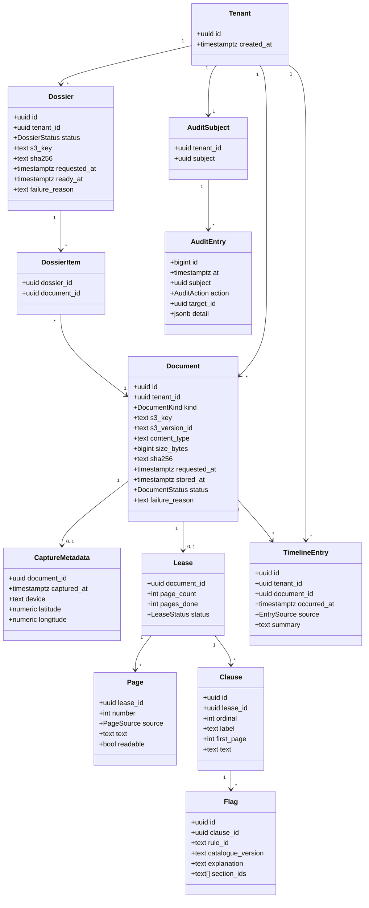
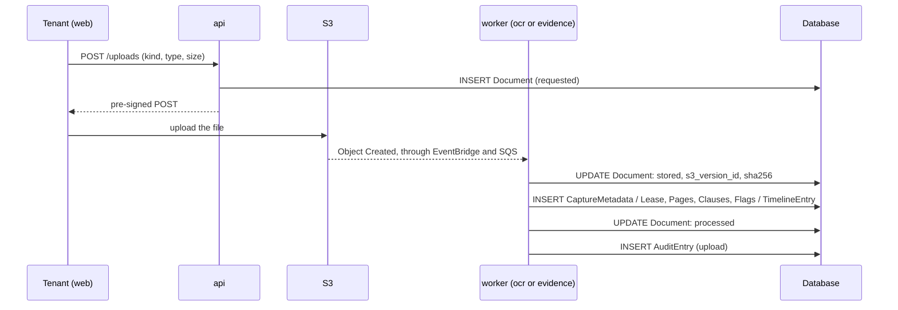
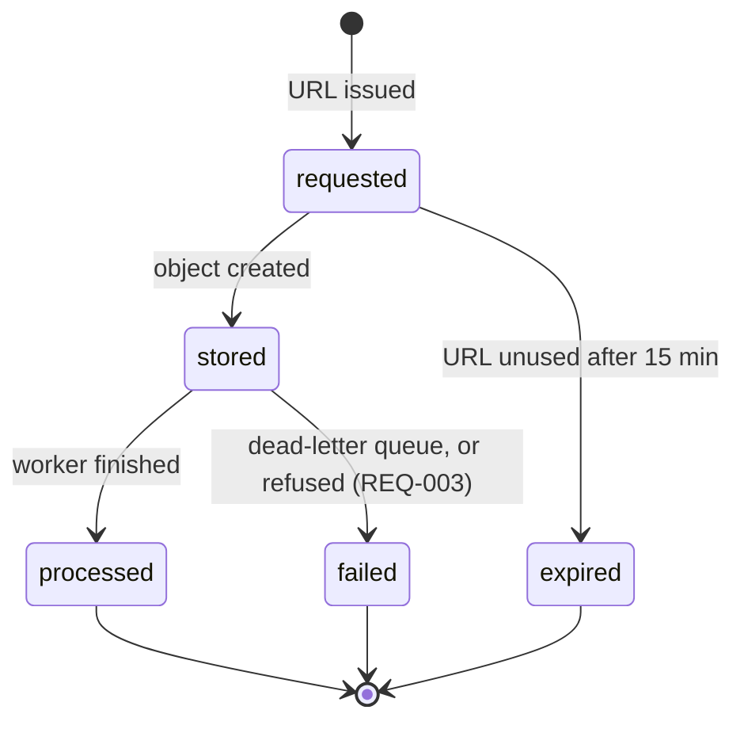

# Design — the domain model

**Status:** agreed · **Owner:** Katlego · **Tasks:** T001, then T023
and every task that reads or writes these tables · **Spec:** [SPEC.md](../../SPEC.md) US1–US4

---

## 1. What this covers

The entities Tokelo stores, in Aurora PostgreSQL (ADR-0004), and the rules they obey. It doesn't
cover three things that live in files, not tables:
- the **rule catalogue** ([ocr.md](ocr.md))
- the **curated legal sections** (`docs/legal/`, T022)
- the **navigator's topics** ([navigator.md](navigator.md))

The schema is `infra/db/migrations/0001_*.sql` (T023), applied through the RDS Data API (ADR-0008). This diagram is what it's checked against.

## 2. Reference material

| Kind | Where |
| --- | --- |
| Requirements | [REQUIREMENTS.md](../../REQUIREMENTS.md): REQ-001, REQ-008 to REQ-013, REQ-016 |
| Database | Aurora PostgreSQL 16 (16.3 or later), IAM authentication (ADR-0004) |
| Where the files are | the documents bucket's key layout, [api.md](api.md) §6 |

## 3. Domain model

**The enumerations:**

| Type | Values |
|---|---|
| `DocumentKind` | `lease`, `photo`, `notice`, `chat` |
| `DocumentStatus` | `requested`, `stored`, `processed`, `failed`, `expired` (§5) |
| `LeaseStatus` | `reading`, `analysed`, `failed` (§5) |
| `PageSource` | `text_layer`, `ocr` |
| `EntrySource` | `capture` (a photo's EXIF time), `notice`, `chat_message` |
| `DossierStatus` | `requested`, `compiling`, `ready`, `failed` (§5) |
| `AuditAction` | `upload`, `verify`, `dossier`, `delete_account` |

**The rules the diagram can't show:**

| Rule | Why | Enforced by |
|---|---|---|
| **Every row of tenant data carries `tenant_id`,** directly or through its parent, and every query filters on the token's tenant | a tenant sees only their own records | the `api`'s data access (T024); REQ-001 |
| **`Tenant.id` is the Cognito user's `sub`** | no second identity to keep in step | [api.md](api.md) §4 |
| **`Document.sha256` is written once,** from the stored object, and never changes after | the digest is the evidence | a trigger that refuses any change to a non-null `sha256` (T023); REQ-008 |
| **A document is idempotent on `(s3_key, s3_version_id)`,** which is unique | a job delivered twice is a no-op (ADR-0007) | a unique constraint |
| **`CaptureMetadata` fields are NULL when the photo doesn't have them,** which the API shows as "not recorded" | never invent a capture time or place | REQ-009 |
| **A `Flag` stores the explanation and sections it was shown with,** and the catalogue version | what the tenant saw stays reproducible after the catalogue improves | [ocr.md](ocr.md) |
| **`AuditEntry` is append-only:** the application role has INSERT and SELECT, but no UPDATE or DELETE | an audit log that can be edited isn't one | table privileges (T023); REQ-011 |
| **The audit log names a pseudonym (`AuditSubject.subject`), never the tenant** | deleting the account deletes the mapping, which leaves the entries anonymous without an UPDATE | REQ-016 |
| **Deleting a tenant cascades** to their documents, metadata, leases, pages, clauses, flags, timeline and dossiers | nothing personal is left behind | foreign keys with `ON DELETE CASCADE`; the files, T048 |
| **Timestamps are `timestamptz`, stored in UTC**, and shown in South African time (SAST, UTC+2) | one clock for the timeline | the API's serializers |

**What isn't stored in the database:** the rules (code), the curated sections and the topics
(files), and file bytes (S3).

## 4. Flow

How the entities come into being over a document's life:

**Failure paths:**
- **The tenant never uploads:** the document stays `requested` and becomes `expired` after the
  URL's 15 minutes, which the API reports.
- **A worker fails three times:** the job goes to the dead-letter queue, and the document becomes
  `failed` with its reason ([infrastructure.md](infrastructure.md) §4).

## 5. State

A lease is `reading` while its pages are read, and `analysed` once the last page is done and its
clauses are flagged. It's `failed` only if no page could be read; an unreadable page alone is
recorded on its `Page` (REQ-004). A dossier goes `requested` → `compiling` → `ready`, or
`failed`. No state goes backwards: a failed document is uploaded again as a new document.

## 6. Contracts

These tables are the contract between the `api` and the workers: all of them read and write the
same database. The column types are the diagram's. The SQL is T023's.

## 7. Structure

| Path | New? | Responsibility |
| --- | --- | --- |
| `infra/db/migrations/0001_initial.sql` | new | the tables, enumerations, constraints, the `sha256` trigger, and the roles' privileges |
| `src/tokelo/core/db.py` | new | connections (IAM token, retry, close per invocation; ADR-0004) and the tenant-scoped queries |
| `src/tokelo/core/model.py` | new | the enumerations and row types above, and nothing else |

## 8. Decisions & alternatives

| Decision | Chosen | Rejected, and why |
| --- | --- | --- |
| One table for every upload, or one per kind | **one `Document` table,** with a `kind` | one per kind: four copies of the key, digest and status, and a dossier would select across four tables |
| A lease's digest | **taken for leases too,** like evidence | leases only analysed: the dossier includes the lease, and its digest costs nothing |
| Anonymising the audit log on deletion | **a pseudonym, whose mapping is deleted** | updating the entries breaks append-only; deleting them loses the record of what happened |
| What a flag keeps | **a snapshot of its explanation, sections and catalogue version** | a reference to the rule: the tenant's history would change when a rule is reworded |
| Identifiers | **UUIDs** (`gen_random_uuid()`); the audit log uses `bigint` identity | serial IDs in URLs let one tenant count another's records |

Deviations from [docs/architecture-defaults.md](../architecture-defaults.md): none that this
lane decides. The database itself is ADR-0004's.

## 9. How this is verified

- `tests/integration/test_schema.py` (T023), against PostgreSQL 16 in Docker:
  - the application role can't UPDATE or DELETE the audit log
  - a second `sha256` for a document is refused
  - a repeated `(s3_key, s3_version_id)` is refused
  - deleting a tenant leaves no row of theirs, and their audit entries without a subject
- Review: every column in the migration is in this diagram, and every entity in the diagram is in
  the migration.

## 10. Open questions

- [ ] How long a `failed` or `expired` document's row is kept. Proposed: until the tenant deletes
  it or their account; nothing is removed automatically.

## Threats (STRIDE)

| Threat | STRIDE | Where | Mitigation | Proven by |
|---|---|---|---|---|
| A tenant reads another tenant's rows | Information disclosure | every table with tenant data | every query filters on the token's `tenant_id`; the API answers 404, not 403 | tests/api/test_authz.py (T024) |
| The application rewrites the audit log to hide an action | Repudiation | `AuditEntry` | the application role has no UPDATE or DELETE on it | tests/integration/test_schema.py (T023) |
| A digest is changed after the fact, so a changed file "verifies" | Tampering | `Document.sha256` | the trigger refuses any change once it's set | tests/integration/test_schema.py (T023) |
| An account deletion leaves personal data behind | Information disclosure | every table | cascading deletes, and the audit log names only a pseudonym | tests/api/test_delete_account.py (T048) |
| A worker's retry duplicates rows | Tampering | `Document`, `Page`, `Flag` | the unique `(s3_key, s3_version_id)`, and each insert keyed on its parent | tests/integration/test_schema.py (T023) |
| A compromised function uses the master user | Elevation of privilege | the database roles | functions connect as the application role through IAM; the master password is used only by the migration | the migration's GRANTs, reviewed in T023 |
