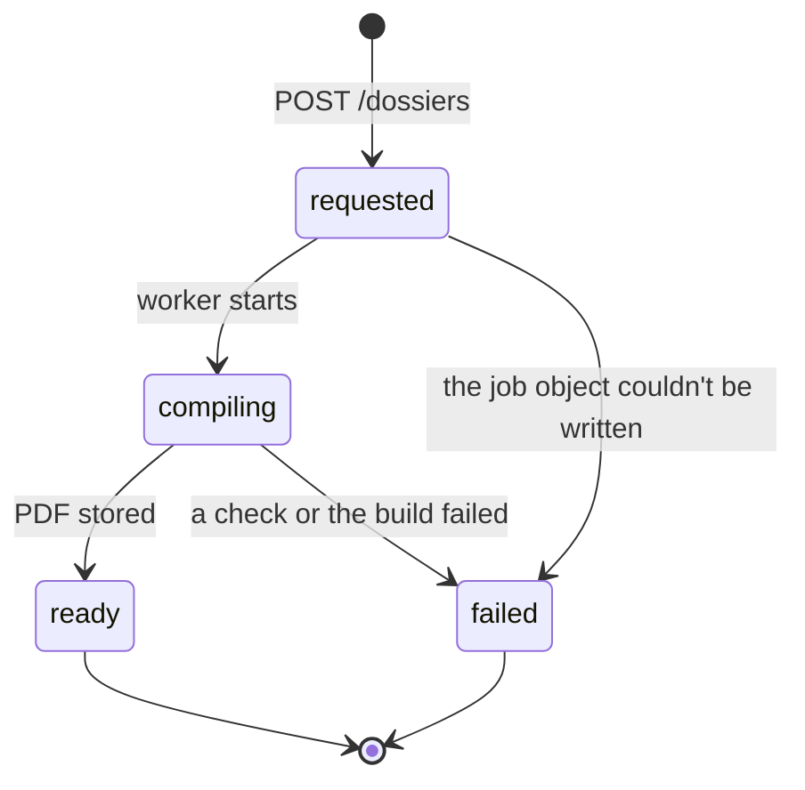

# Design — the `dossier` lane

**Status:** agreed · **Owner:** Katlego · **Tasks:** T008, then T041–T044 · **Spec:**
[SPEC.md](../../SPEC.md) US3

---

## 1. What this covers

The `dossier` worker, which turns a dossier request into one indexed PDF, and the timeline's
ordering rules.

It doesn't cover:
- the request endpoint and the download link: [api.md](api.md) §6
- how timeline entries are created at upload: [evidence.md](evidence.md)
- the screen: [web.md](web.md)

## 2. Reference material

| Kind | Where |
| --- | --- |
| Requirements | REQ-011, REQ-012, REQ-013 |
| The tables | [domain-model.md](domain-model.md): `Dossier`, `DossierItem`, `Document`, `CaptureMetadata`, `TimelineEntry`, `Flag` |
| Libraries | ReportLab (BSD) for the pages Tokelo writes; `pypdf` (BSD) to append the lease's and notices' own pages; Pillow to fit photos to the page |
| Filing requirements | the Rental Housing Tribunals' and the Small Claims Courts' own requirements: not yet obtained (§10) |

## 3. Domain model

The worker reads the tables above, and writes `Dossier.status`, `s3_key`, `sha256` and
`ready_at`, and an `AuditEntry`. Nothing new.

## 4. Flow

```mermaid
sequenceDiagram
    participant Q as dossier queue
    participant X as dossier
    participant D as Database
    participant S as S3
    Q->>X: Object Created: jobs/dossier/{dossier_id}.json
    X->>S: GET the job object
    X->>D: the Dossier; stop if it isn't 'requested' (ADR-0007)
    X->>D: every DossierItem's Document: the dossier's tenant's, and stored? Otherwise failed
    X->>D: Dossier compiling
    X->>D: the timeline entries, capture metadata and lease flags for the selection
    X->>S: GET each selected file, by its recorded version
    X->>X: build the PDF (§6), in /tmp
    X->>S: PUT dossiers/{tenant}/{dossier_id}.pdf
    X->>D: Dossier ready: s3_key, sha256 of the PDF, ready_at; AuditEntry dossier
```

**Failure paths:**
- **A selected document isn't the tenant's, or isn't stored:** `failed`, with the reason. This is
  checked again here, whatever the job object says.
- **A file's digest no longer matches its recorded one:** the dossier is still built, and that
  file's page says **"does not match the digest recorded when it was stored"** in red. Hiding it
  would be worse than showing it.
- **Over 150 documents, or the PDF would pass 100 MB:** `failed` ("too many records"). The `api`
  refuses over 150 before it gets here ([api.md](api.md) §6).
- **A job is delivered twice:** the dossier is no longer `requested`, so the worker stops.

## 5. State



## 6. Contracts

### The PDF, in order

| Part | What's in it |
|---|---|
| 1. Cover | "Dispute dossier", the date it was built, "Prepared with Tokelo", the notice that this is legal information and not legal advice, and how to check a file against its digest (`sha256sum`) |
| 2. Index | each part and each record, with its page number |
| 3. Timeline | every entry of the selected records, in time order (below), each with its date and **where the date came from** |
| 4. The lease | the lease's own pages, then a table of its flagged clauses: the clause, the explanation and the sections |
| 5. Evidence | each photo on its own page, fitted to A4 at up to 150 dpi, with its capture time, device and place (or "not recorded"), its SHA-256, and when it was stored |
| 6. Communications | each notice's own pages; each WhatsApp export's messages as text, in time order |
| 7. The law cited | each curated section the lease's flags cite: its ID, title and text, from T022's set |
| 8. Integrity | every file in the dossier: its name in Tokelo, size, SHA-256 and time stored |

### Ordering the timeline

1. By `occurred_at` (UTC). Entries on the same instant go by their document's upload order, then
   their own order within the document.
2. Shown in SAST (UTC+2).
3. An entry whose date is an upload time is labelled so, and never passed off as when something
   happened.

### Copying a PDF's pages in

When the lease's or a notice's pages are appended, their JavaScript, launch and URI actions,
form fields and embedded files are removed. The rest, the page content, is copied as it is.

## 7. Structure

| Path | New? | Responsibility |
| --- | --- | --- |
| `src/tokelo/dossier/handler.py` | new | the entry point, and the health answer |
| `src/tokelo/dossier/pdf.py` | new | §6's parts, with ReportLab and `pypdf` (T043) |
| `src/tokelo/dossier/sanitize.py` | new | removing actions and attachments from copied pages |
| `src/tokelo/dossier/timeline.py` | new | the ordering rules here, and parsing at upload ([evidence.md](evidence.md); T041) |
| `services/dossier/Dockerfile` | new | Lambda's Python 3.14 base, pinned by digest |
| `tests/dossier/` | new | the parts, the ordering, the sanitising, a mismatched digest |

## 8. Decisions & alternatives

| Decision | Chosen | Rejected, and why |
| --- | --- | --- |
| Building the PDF | **ReportLab, plus `pypdf` to append existing pages** | HTML to PDF (WeasyPrint): system libraries (Pango) in the image, for layout this doesn't need |
| Photos in the dossier | **downscaled to 150 dpi on A4,** with the original's digest | the originals: a 20-photo dossier would be hundreds of MB. The originals stay in Tokelo, verifiable against the listed digests |
| A file whose digest no longer matches | **included, and marked in red** | left out: the tenant, and the Tribunal, should see it |
| The tenant's name on the cover | **none:** Tokelo doesn't store names | asking for one: more personal data, for a cover the tenant can add themselves |
| The PDF's own digest | **recorded** | not recorded: the tenant could then show the file they filed is the one Tokelo built |

Deviations from [docs/architecture-defaults.md](../architecture-defaults.md): none.

## 9. How this is verified

- `tests/dossier/test_pdf.py`, on synthetic records:
  - the parts appear in order, the index's page numbers are right, and every digest matches its
    fixture
  - a foreign document ID fails the dossier
  - a mismatched file is marked (REQ-013)
- `tests/dossier/test_timeline.py`: same-instant entries, SAST display, the "uploaded on" label
  (REQ-012).
- `tests/dossier/test_sanitize.py`: a fixture PDF with JavaScript and an attachment comes out
  without either.

## 10. Open questions

- [ ] **The Tribunals' and Small Claims Courts' filing requirements.** The specification asks for
  their formatting, and it isn't in the curated sources yet. Until someone obtains it, the
  dossier follows §6 and claims no conformance with either.

## Threats (STRIDE)

| Threat | STRIDE | Where | Mitigation | Proven by |
|---|---|---|---|---|
| A job object lists another tenant's documents | Elevation of privilege | the job | every document's owner is checked in the database against the dossier's tenant, not in the object | tests/dossier/test_pdf.py (T043) |
| A notice PDF carries JavaScript or an attachment into the dossier | Tampering | appended pages | actions, forms and attachments are removed when pages are copied | tests/dossier/test_sanitize.py |
| A dossier's download link is shared | Information disclosure | the link | a pre-signed GET for the tenant's own dossier, which expires in 5 minutes ([api.md](api.md)) | tests/api/test_dossier_request.py (T042) |
| The dossier carries the photos' GPS to the other side | Information disclosure | part 5 | only the photos the tenant selects are included, and the web app says the location is shown ([web.md](web.md)) | review of the dossier screen against its reference |
| A tenant denies having built a dossier, or it's altered afterwards | Repudiation | the dossier | an audit entry, and the PDF's own SHA-256 recorded | tests/dossier/test_pdf.py (T043) |
| A huge selection exhausts the function | Denial of service | the worker | at most 150 documents and 100 MB; photos downscaled; maximum concurrency 2 | tests/api/test_dossier_request.py (T042) |
