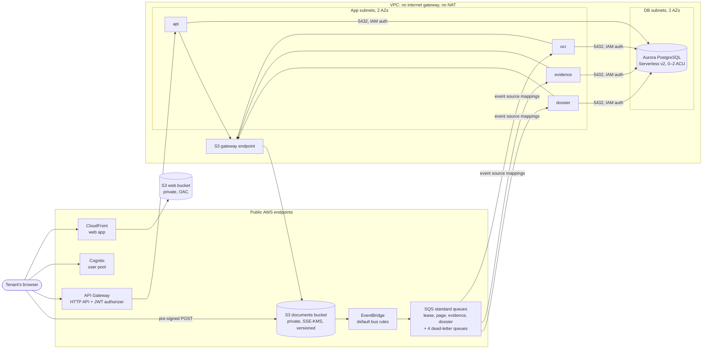

# Design — the infrastructure

**Status:** draft · **Owner:** Katlego · **Tasks:** T005, then T016–T021, T023 (migrations),
T026, T051 · **Spec:** [SPEC.md](../../SPEC.md), the evaluator's four competencies

---

## 1. What this covers

Every AWS resource Tokelo runs on in one environment:
- the network, the database and the documents bucket
- the event rules, the queues and the functions' settings
- the user pool, the HTTP API and the web app's hosting
- the alarms, and what each resource costs

Staging and production are the same design with different values (§6).

It doesn't cover:
- what the bootstrap creates, the CI roles, the Terraform state and the budget: the kit's
  `infra/bootstrap/`, run in T016
- what the functions do: the lane docs

## 2. Reference material

| Kind | Where |
| --- | --- |
| Decisions | ADR-0001 (`eu-west-1`), ADR-0002 (Lambda), ADR-0003 (no way out of the VPC), ADR-0004 (Aurora at 0 ACU), ADR-0007 (standard queues), ADR-0008 (migrations through the Data API) |
| Requirements | REQ-002, REQ-017, REQ-018, REQ-019, NFR-007, NFR-008 |
| The kit | `infra/README.md`, `infra/modules/realm-lambda` (functions, aliases, log groups), and the bootstrap's roles and permissions boundary (the kit's DESIGN.md §14) |
| Prices | ADR-0003's budget, from the AWS Pricing API on 2026-09-19 |

## 3. Domain model

Not applicable: this lane has resources, not entities. §4's diagram and §6's tables are its
model.

## 4. Flow

### What's deployed, and what can reach what

The functions sit in the VPC, but Lambda itself does the invoking, the queue polling, the image
pulling and the log shipping, outside it (ADR-0003). The only things leaving the app subnets are
PostgreSQL to the database, and HTTPS to S3 through the gateway endpoint.

**Failure paths:**
- **A job fails three times:** it goes to its dead-letter queue. The worker marks the item
  `failed` when `ApproximateReceiveCount` reaches 3 and the job still fails. A CloudWatch alarm
  on each dead-letter queue emails the operator.
- **The database is resuming:** the functions retry their connection ([api.md](api.md) §4). The
  queues hold the jobs meanwhile. The visibility timeout (§6) is long enough that a resuming
  database doesn't cause a redelivery.
- **Too many jobs at once:** each trigger's maximum concurrency caps how many run. The rest wait
  in the queue, and nothing is dropped.

## 5. State

Not applicable: no resource here has states that the application moves between. The database's
paused and active states are Aurora's own (ADR-0004).

## 6. Contracts

### The network (per environment)

| Resource | Staging | Production | Notes |
|---|---|---|---|
| VPC | `10.20.0.0/16` | `10.21.0.0/16` | DNS hostnames and support on; **no internet gateway** |
| App subnets | `10.20.1.0/24` (a), `10.20.2.0/24` (b) | `10.21.1.0/24`, `10.21.2.0/24` | the functions |
| DB subnets | `10.20.11.0/24` (a), `10.20.12.0/24` (b) | `10.21.11.0/24`, `10.21.12.0/24` | the database only; Aurora needs two AZs |
| Route tables | local only, plus the S3 gateway endpoint on the app subnets' | the same | **no `0.0.0.0/0` route anywhere** (REQ-018) |
| S3 gateway endpoint | on the app route table | the same | free |
| Security group `fn` | no inbound; outbound TCP 5432 to `db`, TCP 443 to S3's prefix list | the same | every function |
| Security group `db` | inbound TCP 5432 from `fn` only; no outbound | the same | the database |

### The database (ADR-0004, ADR-0008)

| Setting | Value |
|---|---|
| Engine | `aurora-postgresql` 16, the newest 16.x in `eu-west-1` when T018 runs (at least 16.3) |
| Capacity | `db.serverless`, 0 to 2 ACU, pausing after 600 s idle; one instance, no reader |
| Access | not publicly accessible; the DB subnets; security group `db`; IAM authentication on |
| Master user | `manage_master_user_password = true`; used only by migrations through the Data API (`enable_http_endpoint = true`) |
| Storage | encrypted with the AWS-managed RDS key; backups kept 1 day |
| Protection | deletion protection and a final snapshot in production; neither in staging |
| Extras | Performance Insights and Enhanced Monitoring off, because they cost money |

### The documents bucket

| Setting | Value |
|---|---|
| Name | `tokelo-<env>-documents-<account id>` |
| Access | Block Public Access, all four settings; object ownership `BucketOwnerEnforced`; a bucket policy denying any request without TLS |
| Encryption | SSE-KMS with the AWS-managed `aws/s3` key and a bucket key: no USD 1-a-month customer key |
| Versioning | on. Earlier versions expire after 30 days; account deletion removes every version (T048) |
| Lifecycle | `jobs/` objects expire after 7 days; uploads and dossiers stay until the tenant deletes them |
| CORS | `POST` from the web app's CloudFront origin only |
| Events | EventBridge notifications on |

### Events and queues (ADR-0007)

| EventBridge rule on the default bus: S3 "Object Created" in the documents bucket, key matching | Target queue | Worker |
|---|---|---|
| `uploads/*/lease/*` | `tokelo-<env>-lease` | `ocr` (splits the lease into page jobs) |
| `jobs/page/*` | `tokelo-<env>-page` | `ocr` (reads one page) |
| `uploads/*/photo/*`, `uploads/*/notice/*`, `uploads/*/chat/*` | `tokelo-<env>-evidence` | `evidence` |
| `jobs/dossier/*` | `tokelo-<env>-dossier` | `dossier` |

- Each queue is **standard**, with its own dead-letter queue after **3 receives**. Messages are
  kept 4 days in the queue and 14 in the dead-letter queue.
- The visibility timeout is 6 times the function's timeout.
- Each queue's policy accepts messages only from its rule's ARN.

### The functions (the kit's `realm-lambda` module)

| Function | Memory | Timeout | Temporary storage | Trigger | Visibility timeout |
|---|---|---|---|---|---|
| `tokelo-<env>-api` | 512 MB | 29 s (under the HTTP API's 30 s) | 512 MB | API Gateway | none |
| `tokelo-<env>-ocr` | 2,048 MB | 120 s | 1,024 MB | the lease and page queues | 720 s |
| `tokelo-<env>-evidence` | 512 MB | 60 s | 512 MB | the evidence queue | 360 s |
| `tokelo-<env>-dossier` | 1,024 MB | 300 s | 2,048 MB | the dossier queue | 1,800 s |

- Every function is in the app subnets, with security group `fn`, amd64, alias `live`, and logs
  kept 30 days.
- Each queue trigger reads **one message at a time**, reports the failures in its batch, and has
  a **maximum concurrency of 2**. That's the lowest allowed, and it keeps the database's
  connections and the bill small.
- **Each function's role** has the VPC access policy, plus only this:

  | Function | S3 | Database | SQS |
  |---|---|---|---|
  | `api` | `PutObject` on `uploads/*` (to sign the POSTs) and `jobs/dossier/*`; `GetObject` on `uploads/*` and `dossiers/*`; `ListBucketVersions`, `DeleteObject` and `DeleteObjectVersion` under `uploads/`, `dossiers/` (account deletion) | `rds-db:connect` as the application user | none |
  | `ocr` | `GetObject` on `uploads/*/lease/*` and `jobs/page/*`; `PutObject` on `jobs/page/*` | the same | receive and delete on its two queues |
  | `evidence` | `GetObject` and `GetObjectVersion` on `uploads/*` | the same | receive and delete on its queue |
  | `dossier` | `GetObject` on `uploads/*` and `jobs/dossier/*`; `PutObject` on `dossiers/*` | the same | receive and delete on its queue |

  Every role is named `tokelo-<env>-…` under the `/tokelo/` path, with the bootstrap's
  permissions boundary.

### Identity and the API

| Resource | Settings |
|---|---|
| Cognito user pool | sign-in by email; self sign-up with email verification (Cognito's own sender); MFA optional (TOTP); passwords of at least 12 characters; the Lite feature plan |
| Its app client | the web app's: public, no secret, SRP sign-in; access tokens last 1 hour, refresh tokens 30 days |
| HTTP API | [api.md](api.md) §6's routes; a JWT authorizer (the pool as issuer, the app client as audience); Lambda proxy integration, payload 2.0; the default route throttled to 10 requests a second, bursting to 20; CORS for the web app's origin; access logs kept 30 days |

### The web app's hosting

| Resource | Settings |
|---|---|
| Web bucket | `tokelo-<env>-web-<account id>`: private, Block Public Access, read only by CloudFront through origin access control |
| CloudFront | the bucket as its origin; HTTPS only, on its default `*.cloudfront.net` certificate (no domain to buy); `index.html` for any unknown path; a response headers policy with HSTS and a content security policy |

### Alarms

| Alarm | Fires when | Tells |
|---|---|---|
| Each dead-letter queue | `ApproximateNumberOfMessagesVisible` > 0 | the operator, by email through one SNS topic |
| The budget | 50%, 80% and 100% of USD 20, and 100% forecast | the operator (the bootstrap's; REQ-019) |

### What an environment costs (ADR-0003)

| Resource | Idle | In use |
|---|---|---|
| VPC, subnets, route tables, security groups, S3 gateway endpoint | $0 | $0 |
| Aurora | storage only, $0.11 per GB | $0.14 per ACU-hour, plus I/O |
| The master secret | $0.40 a month | the same |
| Lambda, API Gateway, SQS, EventBridge, S3, CloudFront, Cognito | $0 | cents at this scale; Lambda within its always-free allowance |
| CloudWatch logs and alarms, SNS email | $0 | cents |

## 7. Structure

| Path | New? | Responsibility |
| --- | --- | --- |
| `infra/modules/tokelo-env/` | new | one environment: everything in §6, so staging and production can't drift apart |
| `infra/modules/tokelo-env/{network,database,storage,events,functions,identity,api,web,alarms}.tf` | new | one file per §6 table |
| `infra/envs/staging/main.tf`, `infra/envs/production/main.tf` | changed | call `tokelo-env` with the environment's values (CIDRs, protection) |
| `infra/db/migrations/*.sql`, `scripts/migrate.py` | new | ADR-0008's migrations and their runner (T023) |
| `.github/workflows/realm-infra.yml` | changed | runs `scripts/migrate.py` after `terraform apply` (ADR-0008) |

## 8. Decisions & alternatives

| Decision | Chosen | Rejected, and why |
|---|---|---|
| One module for both environments | **`tokelo-env`,** called twice | two copies: they drift, and production gets what staging never ran |
| The database's subnets | **their own two DB subnets** | sharing the app subnets: the specification asks for dedicated DB subnets, and it costs nothing |
| An internet gateway | **none at all** | one for "later": nothing in the VPC needs it, and its absence is the proof of REQ-018 |
| Keys | **the AWS-managed keys** (`aws/s3`, `aws/rds`) | customer keys: USD 1 each a month, for control this project doesn't use |
| Limiting load | **maximum concurrency on each trigger, and API throttling** | reserved concurrency: it takes from the account's pool, which may be small on a new account (§10) |
| The web app's domain | **CloudFront's own** | a custom domain: a registration and a Route 53 zone at USD 0.50 a month |
| Tamper-evidence for files | **digests and versioning** | S3 Object Lock: compliance mode would stop account deletion (REQ-016) |

Deviations from [docs/architecture-defaults.md](../architecture-defaults.md): serverless in place
of containers on servers, and no NAT (ADR-0002, ADR-0003).

## 9. How this is verified

- **`realm-infra`'s plan on each infrastructure PR,** and the gate's Terraform checks: fmt,
  validate, tflint, checkov (with a reason for every skip).
- **T051's inspection record:**
  - the deployed route tables have no `0.0.0.0/0` route
  - the database isn't publicly accessible, and its security group allows only `fn`
  - the bucket's Block Public Access settings are on
  - the budget exists as specified
- **T026's integration test on staging:** an object in each prefix reaches its queue, and a
  failing job reaches its dead-letter queue and raises the alarm.

## 10. Open questions

- [ ] **The account's Lambda concurrency limit.** Check it at T018 with
  `aws lambda get-account-settings`. The design needs 9 at most: the `api`, plus 2 for each of
  the four triggers. If the limit is 10, it fits, with no room for reserved concurrency.
  Requesting an increase is free.
- [ ] **The exact Aurora version:** at T018, `aws rds describe-db-engine-versions --engine
  aurora-postgresql`, taking the newest 16.x (at least 16.3).
- [ ] **Cognito's own email sender has a small daily limit.** It's enough for an elective's sign-ups.
  SES is the change if it isn't.
- [ ] **Which CloudFront edge locations the web app uses** (the price class), given South African
  users and CloudFront's free allowance. Decided in [web.md](web.md).

## Threats (STRIDE)

| Threat | STRIDE | Where | Mitigation | Proven by |
|---|---|---|---|---|
| The database is reachable from the internet | Information disclosure | the VPC | no internet gateway; not publicly accessible; `db` accepts only `fn` | T051's inspection (REQ-018) |
| A function is used to send data out | Information disclosure | the app subnets | no route out except S3 through the gateway endpoint; `fn` allows only 5432 to `db` and 443 to S3 | T051's inspection; the Terraform plan |
| A bucket is made public by mistake | Information disclosure | both buckets | Block Public Access on both; the web bucket readable only by CloudFront; TLS-only policies | checkov in the gate; T051's inspection |
| A forged message is put on a queue | Spoofing | the SQS queues | each queue's policy accepts only its EventBridge rule's ARN | the Terraform plan; T026's test |
| A stored file is overwritten | Tampering | the documents bucket | versioning keeps the original, and the digest taken on storage detects the change (REQ-010) | tests/api/test_verify.py (T039) |
| A flood of requests or jobs runs up the bill | Denial of service | API Gateway, the triggers, Aurora | throttling; maximum concurrency 2 per trigger; Aurora capped at 2 ACU; the budget's alerts | the Terraform plan; the budget (T016) |
| A function's role does more than its job | Elevation of privilege | the IAM roles | §6's per-function permissions; the bootstrap's permissions boundary on every project role | checkov in the gate; review against §6 |
| A change to infrastructure goes unrecorded | Repudiation | the account | every change goes through a PR and `realm-infra`'s plan and apply; CloudTrail's event history is on by default | the workflow runs, and GitHub's history |
| Personal data ends up in the logs | Information disclosure | CloudWatch logs | functions log IDs and outcomes, never file contents or names; logs kept 30 days | review of each lane's logging, and the lane docs' threats |
