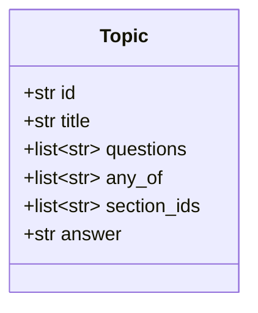
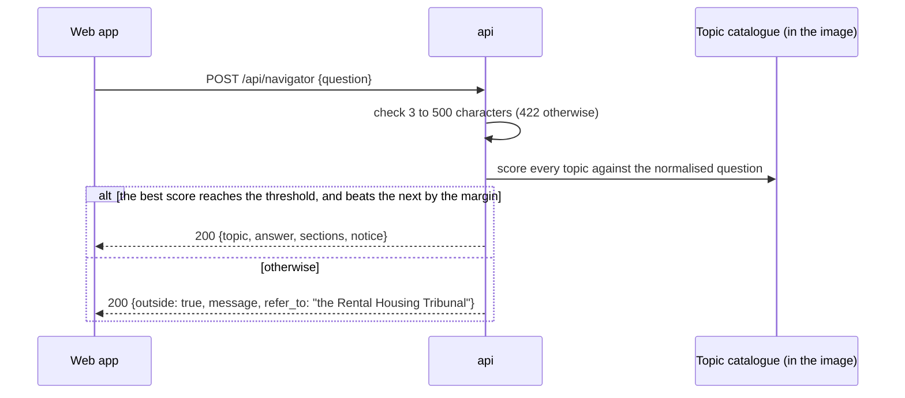

# Design — the navigator

**Status:** draft · **Owner:** Katlego · **Tasks:** T009, then T045–T047 · **Spec:**
[SPEC.md](../../SPEC.md) US4

---

## 1. What this covers

The rights navigator (module D):
- the curated topics' file format
- how a question finds its topic
- the answer or the "outside what Tokelo covers" reply

It runs in the `api`, at `POST /api/navigator`.

It doesn't cover:
- the endpoint's shape: [api.md](api.md) §6
- the curated sections: `docs/legal/`, T022
- the screen: [web.md](web.md)

## 2. Reference material

| Kind | Where |
| --- | --- |
| Requirements | REQ-006, REQ-014 |
| Decisions | ADR-0006 (no language model in phases 1–5: answers are written, not generated), ADR-0009 (English only) |
| The sections an answer may cite | T022's curated set: the Rental Housing Act 50 of 1999, the Consumer Protection Act 68 of 2008 (sections 14 and 48), the PIE Act 19 of 1998 |

## 3. Domain model

Topics are files, not rows, and questions aren't stored (§ Threats).



| Field | What it is |
|---|---|
| `id`, `title` | a stable ID; the title shown above the answer |
| `questions` | example phrasings a tenant might use, at least 3; also the topic's tests |
| `any_of` | case-insensitive patterns; a question that matches one is a strong signal |
| `section_ids` | the curated sections the answer rests on, at least 1 |
| `answer` | the written answer, plain text in short paragraphs, from the cited sections and nothing beyond them |

## 4. Flow



**Scoring** is deterministic:
1. The question is lower-cased, and its punctuation removed.
2. A topic scores 2 for each `any_of` pattern the question matches, plus the share of the
   question's words, after stop words are dropped, that appear in its best-matching example
   question.
3. The best topic wins only if its score reaches the **threshold** and beats the second by the
   **margin**. Both are fixed by T045's tests (§9), not guessed.
4. A near tie is "outside": it's better to refer the tenant on than to answer the wrong question.

**Failure paths:** there's nothing to fail except a malformed question (422). A catalogue that
doesn't load (§6's checks) stops the `api`'s tests and its image build, so it never reaches a
tenant.

## 5. State

Not applicable: a question is answered in one request, and nothing is kept.

## 6. Contracts

### A topic file (`docs/legal/topics/<id>.md`)

TOML front matter between `+++` lines, then the answer as the file's body:

```markdown
+++
id = "services-and-lockouts"
title = "Services and lock-outs"
questions = ["Can my landlord cut off my water?",
             "The landlord changed the locks, what can I do?",
             "Is it legal to switch off my electricity for late rent?"]
any_of = ['cut (off )?(the )?(water|electricity|power)', 'chang(e|ed) the locks', 'lock(ed)? (me )?out']
section_ids = ["EXAMPLE-SECTION-ID"]
+++
The written answer: short paragraphs in plain English, from the cited sections and nothing
beyond them.
```

The example shows the shape only. The real topics, patterns, sections and answers are T045's,
written from T022's curated sources.

**When the catalogue loads, it refuses:**
- a section ID outside the curated set (REQ-006)
- a topic with no section, or fewer than 3 questions
- a duplicate ID
- an answer over 2,000 characters
- any mention of case law: the curated sources have none (ADR-0006)

### What the topics cover (T045)

Repairs, the landlord's entry, deposits (interest and refunds), services and lock-outs, eviction,
ending a fixed-term lease early, unfair terms, and joint inspections. Each is included only as
far as the curated sections support it.

## 7. Structure

| Path | New? | Responsibility |
| --- | --- | --- |
| `docs/legal/topics/*.md` | new | the topics (T045); copied into the `api` image at build |
| `src/tokelo/api/navigator.py` | new | loading and checking the catalogue; scoring; the two replies (T046) |
| `tests/unit/test_topics.py` | new | every topic cites only curated sections; the catalogue's own checks (T045) |
| `tests/api/test_navigator.py` | new | every example question finds its topic; the out-of-scope set gets "outside" (T046) |

## 8. Decisions & alternatives

| Decision | Chosen | Rejected, and why |
| --- | --- | --- |
| How a question is matched | **patterns and word overlap, deterministic** | a language model or embeddings: ruled out by ADR-0006 for phases 1–5; a model's match can't be shown in a test |
| Where topics live | **Markdown files beside the curated sources,** reviewed in PRs | the database: a legal answer would change without a review |
| A near tie between topics | **"outside what Tokelo covers"** | the top scorer: a confident wrong answer is the worst outcome here |
| Keeping questions | **never stored or logged** | a log for tuning: tenants' questions are personal; T045's tests tune the matching instead |

Deviations from [docs/architecture-defaults.md](../architecture-defaults.md): none.

## 9. How this is verified

- `tests/unit/test_topics.py`: every topic's sections are curated, and each rule in §6's list
  refuses a bad topic (REQ-006).
- `tests/api/test_navigator.py`:
  - **every example question finds its own topic**
  - **a fixed set of out-of-scope questions** (subletting, pets, neighbours, rates, business
    leases) gets "outside", with the Rental Housing Tribunal named (REQ-014)
  - the threshold and margin are set so that both pass, and kept in the test as the record of why
- Every answer carries the legal-information notice ([api.md](api.md) §6).

## 10. Open questions

- [ ] **The out-of-scope set grows as questions come in.** Tenants' questions aren't stored, so
  its growth comes from the operator's own testing.

## Threats (STRIDE)

| Threat | STRIDE | Where | Mitigation | Proven by |
|---|---|---|---|---|
| An answer cites something outside the curated sources | Tampering | the topics | the catalogue refuses to load an uncurated section, or any case law | tests/unit/test_topics.py (T045) |
| A question matches the wrong topic, and the tenant acts on it | Tampering | scoring | a threshold and a margin; a near tie is "outside"; every example question tested | tests/api/test_navigator.py (T046) |
| A tenant's question, which may be personal, is kept or logged | Information disclosure | `navigator.py` | questions are never stored or logged; only the topic ID or "outside" is logged | review of `navigator.py` against this rule |
| A crafted question makes a pattern run for a long time | Denial of service | the patterns | questions of at most 500 characters; the patterns reviewed for nested repetition; the function's 29 s timeout | tests/api/test_navigator.py (T046) |
| An unauthenticated caller uses the navigator | Spoofing | `/api/navigator` | behind the JWT authorizer like every `/api/` route | an unauthenticated request gives 401 (T024) |
