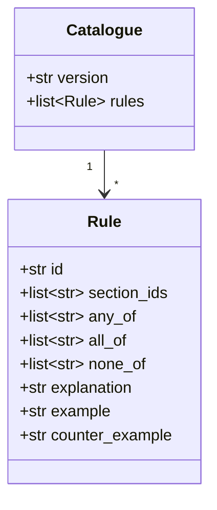

# Design — the `ocr` lane

**Status:** draft · **Owner:** Katlego · **Tasks:** T006, then T028–T033, T036 ·
**Spec:** [SPEC.md](../../SPEC.md) US1

---

## 1. What this covers

The `ocr` worker. It turns a stored lease into:
- the lease's pages (text layer first, OCR otherwise)
- its clauses
- the clauses' flags, from the rule catalogue

It also fixes the rule catalogue's format.

It doesn't cover:
- the upload and the flags endpoint: [api.md](api.md)
- the curated sections the rules cite: `docs/legal/`, T022
- the resources the worker runs on: [infrastructure.md](infrastructure.md)

## 2. Reference material

| Kind | Where |
| --- | --- |
| Requirements | REQ-003 to REQ-007, NFR-003 to NFR-005 |
| Decisions | ADR-0009 (text layer, then Tesseract 5, English only; it supersedes ADR-0005), ADR-0007 (standard queues, idempotent workers) |
| The tables | [domain-model.md](domain-model.md): `Document`, `Lease`, `Page`, `Clause`, `Flag` |
| Libraries | `pypdf` (text layer, page count; BSD), `pypdfium2` (renders a page to an image; Apache-2.0 or BSD), Tesseract 5 through `pytesseract` (Apache-2.0), Pillow (preprocessing) |
| Base image | Debian trixie's `python:3.14-slim`, with `tesseract-ocr` 5.5.0 and `tesseract-ocr-eng` from apt, and AWS's `awslambdaric` (§8). Checked 2026-09-19: Amazon Linux 2023, under Lambda's own Python images, packages no Tesseract |

## 3. Domain model

The worker writes `Lease`, `Page`, `Clause` and `Flag` ([domain-model.md](domain-model.md)).
The rule catalogue is files, not rows:



- `any_of`, `all_of` and `none_of` are case-insensitive regular expressions over one clause's
  text. A rule matches a clause when **at least one of `any_of`** matches, **all of `all_of`**
  match, and **none of `none_of`** does. An empty list places no condition.
- `section_ids` are IDs from the curated set (T022). A rule with an ID outside it is refused
  when the catalogue loads (REQ-006).
- `example` must match and `counter_example` must not. The tests hold every rule to both (T032).
- `version` is the catalogue's own version string, stored on every flag it produces.

## 4. Flow

A lease is one file: a PDF, or a single photo of one page. The web app combines several photos
into one PDF before uploading ([web.md](web.md)).

```mermaid
sequenceDiagram
    participant LQ as lease queue
    participant O as ocr (lease job)
    participant S as S3
    participant D as Database
    participant PQ as page queue
    participant P as ocr (page job)
    LQ->>O: Object Created: uploads/{tenant}/lease/{doc}
    O->>S: GET the object (by version)
    O->>O: check the real type, 30 pages at most (REQ-003)
    O->>D: Document stored (sha256, version); Lease reading, page_count
    loop each page
        alt the page has a text layer
            O->>D: INSERT Page (text_layer); pages_done + 1
        else no text layer
            O->>S: PUT jobs/page/{doc}/{n}.json
        end
    end
    S-->>PQ: Object Created (through EventBridge)
    PQ->>P: one page job
    P->>S: GET the lease, render page n at 300 dpi
    P->>P: preprocess, then Tesseract (eng)
    P->>D: INSERT Page (ocr, readable or not); pages_done + 1
    Note over O,P: whoever makes pages_done = page_count runs the analysis
    P->>D: INSERT Clauses, Flags; Lease analysed; Document processed; AuditEntry upload
```

**Analysis** is the same code, whichever invocation finishes the last page:
1. Join the readable pages' text in page order.
2. Split it into clauses (§6).
3. Run every rule on every clause.
4. Insert a flag per match, with the rule's explanation, sections and the catalogue version.

A clause that matches no rule gets no flag. The API says "no issue found by these checks"
(REQ-007).

**Failure paths:**
- **The file isn't what it claims, or it's over the limits:** the document becomes `failed` with
  the reason, and no pages are read.
- **Tesseract finds too little on a page:** that page is `readable = false`, and the lease is
  still analysed without it (REQ-004). What counts as too little is below the mean-confidence
  threshold that T028's measurement sets.
- **No page is readable:** the lease is `failed`.
- **A job fails three times** (a crash or a timeout): it goes to the dead-letter queue, and the
  document is marked `failed` ([infrastructure.md](infrastructure.md) §4).
- **A job is delivered twice:** the second finds its page already inserted and does nothing.
  `pages_done` is incremented only when the insert happened.

## 5. State

The lease's states are [domain-model.md](domain-model.md) §5's: `reading` → `analysed` or
`failed`. A page doesn't change state: it's inserted once, readable or not.

## 6. Contracts

### The page job object (`jobs/page/{document_id}/{n}.json`)

```json
{"version": 1, "document_id": "uuid", "s3_key": "uploads/…/lease/…",
 "s3_version_id": "…", "page": 3, "page_count": 12}
```

### A rule file (`src/tokelo/ocr/rules/*.toml`)

Every rule file declares the catalogue's version, and all files must agree. The example below
shows the shape only. The real IDs, patterns and explanations are T032's, written from T022's
curated sources.

```toml
catalogue_version = "2026-10-01.1"

[[rule]]
id = "EXAMPLE-LOCKOUT"
section_ids = ["EXAMPLE-SECTION-ID"]
any_of = ['change (the )?locks?', 'lock (the tenant )?out']
all_of = []
none_of = ['court order']
explanation = "Plain-language text written from the cited section, and nothing beyond it."
example = "The landlord may change the locks if rent is 7 days late."
counter_example = "The landlord may change the locks under a court order."
```

### Splitting into clauses

A new clause starts at a line that begins with a clause number:
- `12.` or `12.3`
- `(a)`
- `Clause 12`

Headings in capitals stay with the clause that follows them. Text before the first number is
clause 0, "Preamble". Each clause keeps its label as written, its order, and the page it starts
on. The sample leases (T028) are the test of this rule.

### What the worker takes from the event

The S3 key and version ID, from EventBridge's `Object Created` detail. It never takes a size or
type from the client (§ Threats).

## 7. Structure

| Path | New? | Responsibility |
| --- | --- | --- |
| `src/tokelo/ocr/handler.py` | new | the entry point: the lease or page job by the queue's ARN; the health answer |
| `src/tokelo/ocr/intake.py` | new | the real type and the page count (T030) |
| `src/tokelo/ocr/pages.py` | new | the text layer, rendering, preprocessing, Tesseract (T029) |
| `src/tokelo/ocr/clauses.py` | new | §6's splitting (T031) |
| `src/tokelo/ocr/rules/__init__.py`, `src/tokelo/ocr/rules/*.toml` | new | loading and checking the catalogue; the rules (T032) |
| `src/tokelo/ocr/flags.py` | new | running the rules, storing the flags (T033) |
| `services/ocr/Dockerfile` | new | §2's base image, the apt packages, `awslambdaric`, pinned by digest |
| `tests/fixtures/leases/`, `tests/ocr/` | new | the synthetic samples and their known text (T028) |

## 8. Decisions & alternatives

| Decision | Chosen | Rejected, and why |
| --- | --- | --- |
| The `ocr` image's base | **Debian's slim Python image, with Tesseract from apt and AWS's runtime client** | Lambda's Python base image: Amazon Linux 2023 has no Tesseract package, and building it from source is slow and hard to keep patched |
| Rendering a PDF page for OCR | **`pypdfium2`** | `pdftoppm` (Poppler): a second set of system packages, under the GPL |
| Fan-out | **one page job per page without a text layer, as an S3 object** (ADR-0003) | all pages in one invocation: a 30-page scan could pass Lambda's 15 minutes |
| Knowing when the last page is done | **a counter in the database, incremented with the page's insert** | a separate "finished" job: another queue, and the same race to solve |
| The rules | **deterministic patterns in TOML,** each with its example and counter-example | a model: ruled out by ADR-0006; ad-hoc code: rules nobody can review as a list |
| A lease photographed as several pages | **combined into one PDF by the web app before upload** | several uploads per lease: the agreed `POST /uploads` has no way to group them |

Deviations from [docs/architecture-defaults.md](../architecture-defaults.md): the `ocr` image's
base, above.

## 9. How this is verified

- `tests/ocr/test_accuracy.py` (T028, T029) over the synthetic samples: the character error rate
  and the time per page (NFR-004, NFR-005).
- `tests/ocr/test_pages.py`: an unreadable page is reported by number (REQ-004).
- `tests/api/test_lease_intake.py`: a renamed .docx, a 31-page PDF and a 25 MB file are refused
  (REQ-003).
- `tests/ocr/test_clauses.py`: the samples split into their known clauses.
- `tests/unit/test_rules.py`: every rule's example matches, its counter-example doesn't, and
  every section ID is curated (REQ-005, REQ-006).
- `tests/ocr/test_flags.py`:
  - a clause with no match reads "no issue found by these checks" (REQ-007)
  - a job delivered twice changes nothing
- `tests/e2e/test_lease_timing.py` on staging (NFR-003).

## 10. Open questions

- [ ] **The readability threshold** (Tesseract's mean confidence) is set from T028's measurement,
  not guessed.
- [ ] **If Tesseract misses NFR-005 on the photo samples,** T029 is blocked and a new ADR proposes
  PaddleOCR (ADR-0009).

## Threats (STRIDE)

| Threat | STRIDE | Where | Mitigation | Proven by |
|---|---|---|---|---|
| A crafted PDF exhausts memory or time (a decompression bomb, thousands of objects) | Denial of service | `intake.py`, `pages.py` | at most 30 pages and 20 MB; Pillow's pixel limit; rendering at a fixed 300 dpi; the function's timeout and memory; maximum concurrency 2 | tests/api/test_lease_intake.py (T030) |
| A parser flaw in `pypdf`, `pypdfium2` or Tesseract is exploited by a crafted file | Elevation of privilege | the `ocr` function | the libraries pinned, and osv-scanner in the gate; the function's role reads only leases and page jobs, and reaches only the database and S3 | the gate's vulnerability scan; [infrastructure.md](infrastructure.md) §6's role |
| A file renamed to look like a PDF or photo | Tampering | the intake | the type is read from the file's bytes, not from its name or claimed type | tests/api/test_lease_intake.py (T030) |
| A forged page job makes the worker read another tenant's lease | Spoofing | `jobs/page/*` | only the `ocr` role can write under `jobs/page/`; the job's document is looked up in the database, and its key must match | tests/ocr/test_pages.py (T029) |
| A flag cites something outside the curated sources | Tampering | the catalogue | a rule with an uncurated section ID stops the catalogue from loading | tests/unit/test_rules.py (T032, REQ-006) |
| A lease's text leaks into the logs | Information disclosure | logging | the worker logs IDs, counts and timings, never page or clause text | review of `ocr/` against this rule |
| A retried job duplicates pages or flags | Tampering | the database | unique pages per lease and number; the counter moves only on a real insert | tests/ocr/test_flags.py (T033) |
