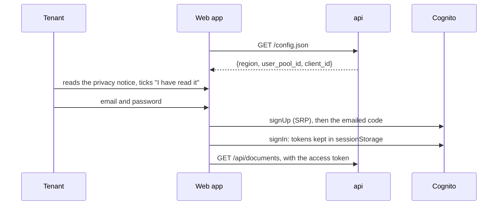
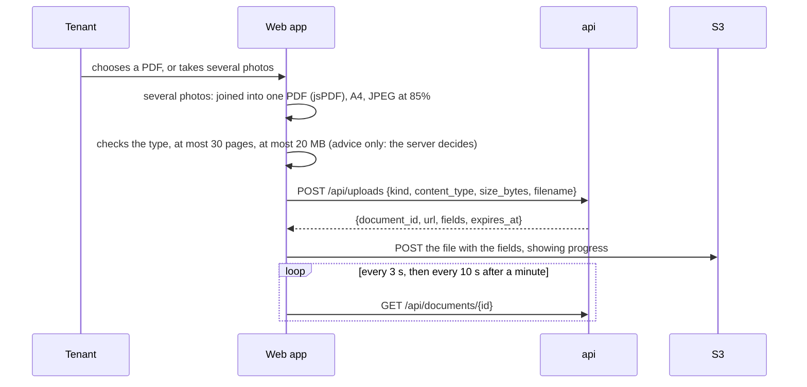
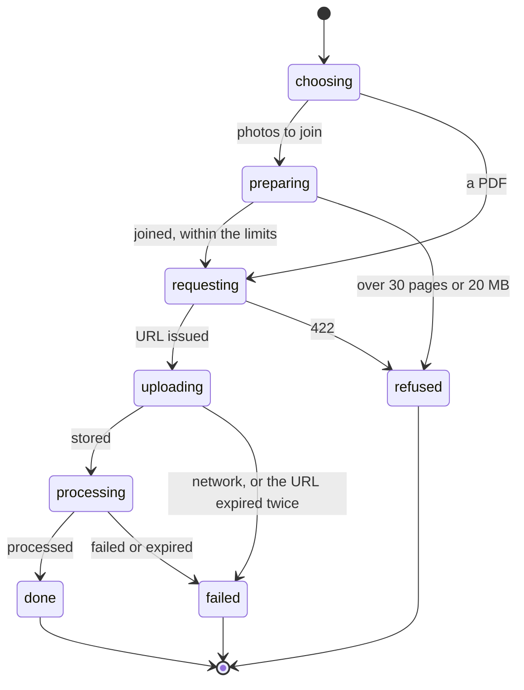
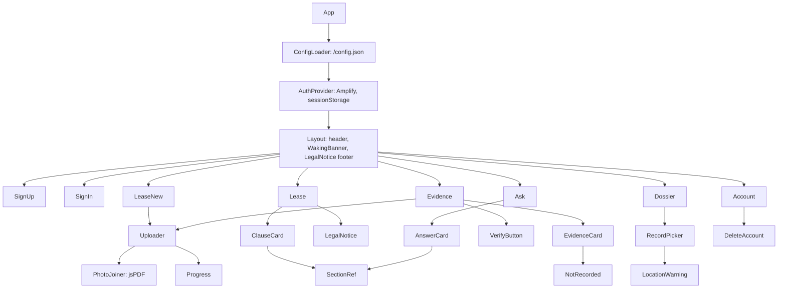

# Design — the web app

**Status:** agreed · **Owner:** Katlego · **Tasks:** T010, then T014, T027, T035, T040, T044,
T047, T048 · **Spec:** [SPEC.md](../../SPEC.md) US1–US4

---

## 1. What this covers

The tenant's web app:
- its screens and their reference images
- its components
- how it signs in, uploads and waits for the database
- the pinned toolchain
- how it's served and released (ADR-0010)

It doesn't cover:
- what each endpoint does: [api.md](api.md)
- the navigator's matching: [navigator.md](navigator.md)

The app is in English only (ADR-0009).

## 2. Reference material

| Kind | Where |
| --- | --- |
| Visual references | [`sign-up.svg`](web/sign-up.svg) (sign-up and sign-in), [`upload.svg`](web/upload.svg), [`lease.svg`](web/lease.svg), [`evidence.svg`](web/evidence.svg), [`dossier.svg`](web/dossier.svg), [`navigator.svg`](web/navigator.svg), [`account.svg`](web/account.svg): phone-sized wireframes of layout, order and copy. They aren't a colour spec: shadcn/ui's default theme is the design system |
| Design system | shadcn/ui components (Radix, Tailwind, CVA), copied into `web/src/components/ui/` by its CLI |
| The API | [api.md](api.md) §6: the endpoints under `/api/`, and the views, which the app's types mirror |
| Standards | WCAG 2.1 AA (NFR-009), checked with axe; Cognito SRP sign-in through Amplify's Auth module |

### The toolchain

Pinned on 2026-09-19 from the npm registry and nodejs.org, under the same 7-day cooldown as the
Python side: `package-lock.json` was resolved with `npm install --before 2026-09-12`, so no
package, direct or transitive, is newer than a week (T014):

| Package | Version | Notes |
|---|---|---|
| Node | 24.21.0 (LTS "Krypton") | `engines` and `.nvmrc` |
| react, react-dom | 19.3.0 | |
| vite, @vitejs/plugin-react | 8.3.0, 6.1.1 | |
| typescript | **6.0.3** | not 7.0: `typescript-eslint` 8.70 supports TypeScript below 6.1 only |
| tailwindcss, @tailwindcss/vite | 4.3.3 | |
| radix-ui, class-variance-authority, tailwind-merge | 1.6.7, 0.7.1, 3.7.0 | what shadcn/ui's components use |
| react-router | 8.4.0 | |
| aws-amplify | 6.20.0 | Auth only, imported as `aws-amplify/auth` |
| jspdf | 4.2.1 (MIT) | joining photos into one PDF; not `pdf-lib`, unpublished since 2022 |
| vitest, jsdom, @testing-library/react, @testing-library/dom, axe-core | 5.0.0, 30.0.1, 16.3.3, 10.4.1, 4.13.0 | the cooldown held back vitest 5.0.1, jsdom 30.1.0 and @testing-library/dom 10.4.2 |
| eslint, @eslint/js, typescript-eslint, globals | 10.10.0, 10.0.1, 8.70.0, 17.12.0 | the cooldown held back eslint 10.11.0 |
| @types/react, @types/react-dom | 19.3.0 | |

`package-lock.json` pins everything beneath. The gate runs `npm run lint` (ESLint, then `tsc
--noEmit`), `npm test` (Vitest) and `npm run build` (Vite).

## 3. Domain model

The app holds no domain of its own. Its TypeScript types mirror [api.md](api.md) §6's views
exactly (`DocumentView`, `LeaseFlags`, `Verification`, `TimelineEntryView`, `Answer`,
`Outside`, `Error`), in `web/src/api/types.ts`. A field that isn't in a view isn't in a type.

## 4. Flow

### Signing up and in



"Create account" stays disabled until the notice is ticked (REQ-015).

### Uploading



### When the server is still waking up (NFR-002)

Every API call goes through one client, `web/src/api/client.ts`. On any `503` with a
`Retry-After` — `store_unavailable`, or a cold function that took too long ([api.md](api.md) §4)
— it shows the banner "Still waking up: a few seconds" and retries after `Retry-After`, up to 4
times. Then it shows the error. No screen handles 503 on its own.

**Failure paths:**
- **The server refuses an upload (422):** the reason is shown as the server wrote it.
- **The pre-signed URL expired before the upload:** it asks for a new one once, then shows the
  error.
- **A document reads `failed`:** its reason is shown, and the tenant can upload it again as a new
  document.
- **The token expired:** Amplify refreshes it. If that fails, the app goes to sign-in and keeps
  the page to return to.

## 5. State

An upload, as the tenant sees it:



## 6. Contracts

### Screens and routes

| Route | Screen | Reference | Task | Requirements |
|---|---|---|---|---|
| `/sign-up`, `/sign-in` | the privacy notice, then the account; sign-in | [sign-up.svg](web/sign-up.svg) | T027 | REQ-015, REQ-001 |
| `/lease/new`, `/evidence/new` | the upload widget | [upload.svg](web/upload.svg) | T027 | REQ-002, REQ-003 |
| `/lease/:id` | a lease's flags | [lease.svg](web/lease.svg) | T035 | REQ-004 to REQ-007 |
| `/evidence` | evidence, with capture details, digest, verify | [evidence.svg](web/evidence.svg) | T040 | REQ-008 to REQ-010 |
| `/dossier` | choose records, build, download | [dossier.svg](web/dossier.svg) | T044 | REQ-013 |
| `/ask` | the navigator | [navigator.svg](web/navigator.svg) | T047 | REQ-014 |
| `/account` | sign out, the notice, delete everything | [account.svg](web/account.svg) | T048 | REQ-016 |

### Wording the screens must keep

- **"This is legal information, not legal advice."** On every flag, answer and dossier, as the
  API sends it.
- **"No issue found by these checks."** Never "lawful" or "OK" (REQ-007).
- **"Not recorded."** For any missing capture detail (REQ-009).
- **"N selected photos include their location."** Shown before a dossier with located photos is
  built.

### `GET /config.json`

The `api` answers this from its environment (ADR-0010), so one image serves staging and
production:

```json
{"region": "eu-west-1", "user_pool_id": "eu-west-1_…", "client_id": "…"}
```

### The component tree



Every screen is built from `web/src/components/ui/` (shadcn/ui), never hand-rolled markup.

## 7. Structure

| Path | New? | Responsibility |
| --- | --- | --- |
| `web/package.json`, `package-lock.json`, `.nvmrc`, `vite.config.ts`, `eslint.config.js`, `tsconfig.json` | new | §2's toolchain and the gate's three scripts (T014) |
| `web/src/api/client.ts`, `web/src/api/types.ts` | new | one API client, with the 503 retry; the view types |
| `web/src/auth/` | new | Amplify's configuration from `/config.json`; sessionStorage for tokens |
| `web/src/components/ui/` | new | shadcn/ui's components |
| `web/src/components/` | new | §6's tree: Uploader, PhotoJoiner, ClauseCard, SectionRef, EvidenceCard, NotRecorded, RecordPicker, LocationWarning, AnswerCard, WakingBanner, LegalNotice, DeleteAccount |
| `web/src/routes/` | new | one file per screen in §6 |
| `web/src/**/*.test.tsx` | new | behaviour, and axe on every screen |
| `services/api/Dockerfile` | changed | a Node stage builds `web/`, and its `dist/` is copied into the image (ADR-0010) |
| `src/tokelo/api/static.py` | new | serves `dist/`, the caching and security headers, `/config.json` (ADR-0010) |

## 8. Decisions & alternatives

| Decision | Chosen | Rejected, and why |
| --- | --- | --- |
| Where the app is served from | **the `api` function, from its image** (ADR-0010) | S3 and CloudFront: outside the kit's pa11y, ZAP, signing and promotion |
| Settings per environment | **`/config.json` at run time** | baked in at build: the same image couldn't be promoted from staging to production |
| Where tokens are kept | **sessionStorage** | localStorage: they'd outlive the tab; cookies: the API takes bearer tokens |
| A lease photographed as several pages | **joined into one PDF in the browser** | several uploads per lease: the agreed `POST /api/uploads` has no way to group them ([ocr.md](ocr.md)) |
| Accessibility per screen | **axe in each screen's tests,** as well as pa11y in the release | pa11y alone: in the release it can only reach the public pages, not the signed-in ones |
| TypeScript | **6.0.3** | 7.0.2, the newest: `typescript-eslint` doesn't support it yet |
| Analytics | **none** | any third-party script: tenants' documents are personal, and the CSP stays `'self'` |

Deviations from [docs/architecture-defaults.md](../architecture-defaults.md): the app is served
by the `api`'s function, not its own container (ADR-0010).

## 9. How this is verified

- Every screen's tests (Vitest, Testing Library), written first:
  - the behaviour in its reference: the notice gates "Create account"; the wording in §6
  - **axe reports 0 violations** (NFR-009)
- `client.test.ts`: a 503 with `Retry-After` shows the banner and retries after it,
  up to 4 times (NFR-002).
- `PhotoJoiner.test.ts`: 4 photos become one 4-page PDF, and 31 are refused.
- The release pipeline: pa11y with axe on the `api`'s staging URL (`ui = true`); ZAP on the same
  URL.
- Review: each screen against its reference image, for layout, order and copy.

## 10. Open questions

- [ ] **The privacy notice's full text** (REQ-015) is Katlego's to approve. It states facts about
  storage, and the section 72 basis, and must be right.
- [ ] **HEIC photos** ([api.md](api.md) §10). Browsers usually hand over JPEG, but not always.

## Threats (STRIDE)

| Threat | STRIDE | Where | Mitigation | Proven by |
|---|---|---|---|---|
| A script injected into a page steals tokens or documents | Information disclosure | the app | React escapes all text; no `dangerouslySetInnerHTML`; answers rendered as plain paragraphs; a CSP of `'self'` (plus Cognito and the documents bucket for `connect-src`); tokens only in sessionStorage | the CSP header test in `static.py` (T014); lint forbids `dangerouslySetInnerHTML` |
| The app is framed to trick a tenant into clicking | Tampering | the pages | `frame-ancestors 'none'` in the CSP | the header test (T014) |
| A tenant builds a dossier without realising it shows where they live | Information disclosure | the dossier screen | the location warning before building (§6) | the dossier screen's test (T044) |
| Someone deletes an account by a stray tap | Tampering | the account screen | typing DELETE to confirm, and the button disabled until then | the account screen's test (T048) |
| A tenant believes a check the browser made is the server's | Spoofing | the limits | the browser's checks are advice only; the server decides, and its reason is shown (422) | the upload widget's tests (T027) |
| A third-party script reads tenants' pages | Information disclosure | the app | no analytics or outside scripts; the CSP blocks them | the CSP header test (T014) |
