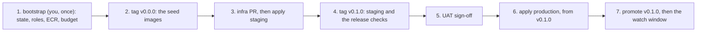

# Releasing

How a Secret Realm project gets a version to production and back (DESIGN.md §5.2). Everything
runs through `scripts/realm/release.sh`, in the release workflows or on your machine.

## The path of a release

| Step | Who | What happens | Command |
|---|---|---|---|
| 1. Tag | release owner | `git tag v1.4.0 && git push origin v1.4.0` starts `realm-release` | — |
| 2. Build | pipeline | only if the tag is on `main`: each image built twice for `linux/amd64` and compared (reproducible?), an SBOM each, `release.json` signed | `release.sh build v1.4.0` |
| 3. Archive | pipeline | the images pushed to `[deploy] registry`, keeping their digests | `release.sh publish v1.4.0` |
| 4. Stage | pipeline | staging gets the release; then the release checks; then the record | `release.sh stage v1.4.0` |
| 5. UAT | a person | test on staging; fill in the record's UAT sign-off and exploratory notes in its PR; merge | — |
| 6. Promote | release owner | start `realm-promote` for v1.4.0: production, then the watch window | `release.sh promote v1.4.0` |
| 7. Watch | pipeline | steady traffic against `docs/ops/slo.toml` for `[watch] minutes`; a broken objective puts the previous release back and opens an incident | (part of promote) |

**Only a commit on `main` is released.** A tag can point at any commit, so `build` refuses one
that isn't on `origin/main` (or on `main`, where there's no `origin`). Merge first, then tag.

**Images are built for `linux/amd64`,** whatever the machine: an Apple-silicon Mac would otherwise
build ARM images, which x86 hosts won't run.

## The release checks (on staging)

| Check | Tool | Passes when |
|---|---|---|
| smoke | curl; for a worker, the platform's `health` | every web service's health path answers 200; every worker passes its health check |
| performance | k6, every `perf/*.js` | every threshold (your NFR targets) holds |
| accessibility | pa11y with axe, on web services with `ui = true` | axe finds no issues on `/` |
| DAST | the OWASP ZAP baseline scan, on web services | no failures, and no warning the project hasn't decided about in `docs/release/zap-rules.tsv` (with a reason) |
| rollback drill | the platform | staging goes back to the live release and forward again, healthy both times |

A check that can't run fails, like the gate's. The record lists every result.

## Services: web and worker

Each `[[service]]` in `realm.toml` has a `kind`:

| | `kind = "web"` (the default) | `kind = "worker"` |
|---|---|---|
| What it is | answers HTTP: an API, a site | has no URL: a queue consumer, say |
| Needs | `port`, `health` (a path that answers 200) | neither; `health` and `ui` are refused |
| Built, signed, deployed, rolled back | yes | yes |
| Smoke test | its health path answers 200 | the platform's `health` check passes |
| Performance, accessibility, DAST | yes (`BASE_URL_<SERVICE>` for k6) | no |
| Objectives in `docs/ops/slo.toml`, and the watch window | yes, required | no: set the objective on the web service in front of it |

**A worker's health, per platform.** The app's side of the contract is to keep running:

| Platform | A worker is healthy when |
|---|---|
| compose | its container is running, and hasn't restarted since it was deployed. The deploy waits for three checks in a row, a second apart, so a crash at start-up fails it |
| railway | its deployment is running (status `SUCCESS`). Railway marks a deployment whose process dies `CRASHED` |
| aws, ECS | its running tasks equal the desired count, and the latest rollout completed |
| aws, Lambda | the version behind the alias `live` answers the event `{"realm": "health"}` with `{"ok": true}`. Lambda's own state only says the code was loaded, so **the handler must answer this call** without doing any work |

## Performance tests with credentials

A performance test against an authenticated endpoint needs a test user. Put its details in the
repo secret `PERF_ENV`, one `KEY=value` per line:

```
# the performance test user (staging only)
TEST_USER_EMAIL=perf@example.com
TEST_USER_PASSWORD=<the test user's password>
```

- Each line reaches every `perf/*.js` as `__ENV.KEY`, next to `BASE_URL_<SERVICE>`.
- Names are capitals, digits and `_`. Blank lines and `#` lines are skipped. A value is everything
  after the first `=`, spaces included.
- The values reach k6 through its environment, never on a command line, and the pipeline never
  prints them. A line that's wrong stops the release before anything deploys, and the error
  names only its line number.
- The watch window sends no credentials: its objectives are on paths that answer without them.

## The record

`docs/releases/<version>.md` holds the state, the commit, the images and their digests, the
requirements and tasks shipped, every check's result, the UAT sign-off, and what happened at
promotion. States: `staged` or `rejected` after staging; `live`, `replaced` or `rolled back`
after that. `realm trace` reads its Requirements line, so a requirement is `released` only once a
record lists it.

## Rolling back

- **By itself:** when the watch window sees an objective break.
- **By hand:** `release.sh rollback v1.3.0` puts v1.3.0 back in production and records it.
- **Rehearsed:** every release rolls staging back and forward before it's promoted.

## Release freezes

`[release] freeze = ["2026-12-20/2027-01-04"]` in `realm.toml` stops promotions in those windows.
Only a fix that can't wait gets through, with `--emergency "<reason>"`, which the record keeps.

## Feature flags

Keep them in a config file the app reads at start-up (for example `config/flags.toml`), default
off, and name the task that will remove each one. A flag lets you deploy code before you release
it: the release gets it to production, and the flag turns it on for users.

## Platforms

- **railway** (the default): staging and production are Railway environments.
  - `mode = "source"` works on any plan: Railway builds the release's commit.
  - `mode = "image"` (Railway Pro, for a private registry) deploys the signed image by digest.
    The assured tier requires it.
  - The settings are in `realm.toml`: `[deploy] staging` and `production` (environment IDs),
    and for each `[[service]]` its `railway_service` ID and its `staging_url` and
    `production_url`.
  - The token goes in the `RAILWAY_API_TOKEN` secret.
- **compose**: staging and production on one Docker host, on local ports (staging from 18000,
  production from 19000). For trying the pipeline out, and for a single self-hosted box.
- **aws** (DESIGN.md §14): each service runs on **ECS on Fargate** or **Lambda**, from the
  release's images in **ECR**, by digest.
  - The settings are in `realm.toml`: `[deploy] region` and `registry` (the project's ECR
    repository), and for each `[[service]]` its `runtime` (`ecs` or `lambda`) and, for a web
    service, its `staging_url` and `production_url`.
  - Names follow the kit's Terraform modules, so `realm.toml` holds no resource IDs: the ECS
    cluster `<name>-<env>`, the service, task family and function `<name>-<env>-<service>`, the
    container `<service>`, and the Lambda alias `live`.
  - A deploy on ECS registers a copy of the service's task definition with only that container's
    image changed, and passes when that revision's rollout completes. If ECS's circuit breaker
    rolls it back, the deploy fails and quotes the service's events. On Lambda, a deploy publishes
    a version and moves `live` to it once it's `Active`.
  - `publish` signs in to ECR with the AWS CLI's token (`aws ecr get-login-password`). An image
    already archived with the same digest isn't pushed again, so a re-run doesn't trip over
    ECR's immutable tags.
  - **The seed, `v0.0.0`:** Terraform creates each service from an image, so the first tag,
    `v0.0.0`, builds, signs and archives the images, then stops. It's never staged, promoted or
    rolled back to; production is created from the first staged release.

## The aws platform, the first time

Nothing can run without an image, and Lambda needs one in ECR before it creates a function. So an
AWS project starts in this order (DESIGN.md §14.3):



1. **The bootstrap,** signed in to your account (`aws login`, then `export AWS_PROFILE=…`):
   `TF_VAR_budget_email=<you> bash scripts/realm/aws-bootstrap.sh`. Terraform shows what it will
   create and waits for your yes. The script then writes each root's `backend.hcl`, moves the
   bootstrap's state into the new bucket, sets the repository variables below, and writes
   `[deploy] registry` into `realm.toml`. Commit those files through a PR.
2. **The seed:** tag `v0.0.0` on `main` and push the tag. The release workflow builds, signs and
   archives the images, then stops.
3. **Staging:** a PR adds the project's architecture to `infra/envs/staging`, from its C4
   containers diagram, with each service from the kit's modules and `initial_image_tag =
   "v0.0.0"` (`infra/README.md`). The PR shows the plan; merging it applies staging.
4. **The first release:** tag `v0.1.0`. It's staged and checked like any release.
5. **UAT** signs off in the release record's PR.
6. **Production:** the same architecture in `infra/envs/production`, with `initial_image_tag =
   "v0.1.0"`, applied by hand: run realm-infra and choose production. So production never runs
   anything that hasn't been through staging.
7. **Promote** `v0.1.0`.

After that, Terraform changes the infrastructure and the pipeline changes only which image runs
(DESIGN.md §14.2). A change that needs both, such as a new queue and the code that reads it,
merges and applies first, then the release follows.

### What an AWS project pays for

`budget_usd` in `infra/bootstrap/terraform.tfvars` sets the monthly budget (USD 20 unless you
change it). AWS emails at 50%, 80% and 100% of it, and when the month's forecast passes it. It
counts usage before credits, so an account running on credits still gets its alerts. It warns;
it stops nothing.

These dominate a small project's bill. Each is an ADR for the project, with the prices checked
when it's written:

| Item | Why it costs | The cheaper choices |
|---|---|---|
| NAT gateways | charged per hour in every AZ, plus per GB | one NAT for both environments, a NAT instance, or VPC endpoints |
| Interface VPC endpoints | per hour, per AZ, per endpoint | only the few the services need; S3 and DynamoDB have free gateway endpoints |
| Multi-AZ databases | twice the instance | Multi-AZ in production only |
| Load balancers | per hour, plus capacity units | API Gateway's HTTP API with a VPC link, per request |
| Public IPv4 addresses | per hour, each | private subnets; IPv6 |
| Fargate tasks left running | per second of vCPU and memory, all the time | Lambda for workers that wait on a queue; the smallest task sizes |
| The bootstrap itself | its KMS key (about USD 1 a month); the rest is within the free tiers | — |

### Its variables

`aws-bootstrap.sh` sets these repository **variables** (not secrets: an ARN grants nothing by
itself):

| Variable | Used by |
|---|---|
| `AWS_REGION` | every job that signs in; its absence means the platform isn't aws |
| `AWS_PLAN_ROLE` | realm-infra, on a PR |
| `AWS_APPLY_ROLE` | realm-infra, on `main` |
| `AWS_RELEASE_ROLE` | realm-release, on a `v*` tag |
| `AWS_PROMOTE_ROLE` | realm-promote, from `main` |

The budget's email goes in only as `TF_VAR_budget_email`, when you run the bootstrap, and never
into a file.

## The secrets the workflows need

| Secret | For |
|---|---|
| `COSIGN_PRIVATE_KEY`, `COSIGN_PASSWORD` | signing `release.json`. Create the pair with `cosign generate-key-pair`; commit `cosign.pub`, never `cosign.key` |
| `RAILWAY_API_TOKEN` | an account or workspace token, on the railway platform |
| `PERF_ENV` | optional: `KEY=value` lines for the performance tests, such as a test user's credentials |
